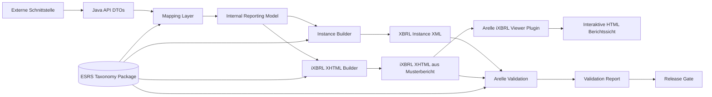
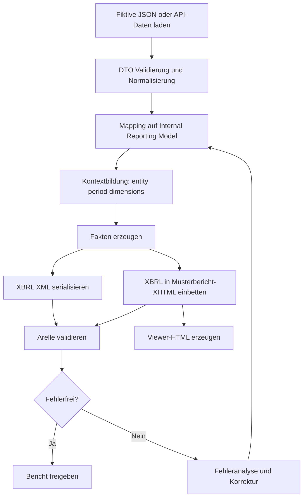
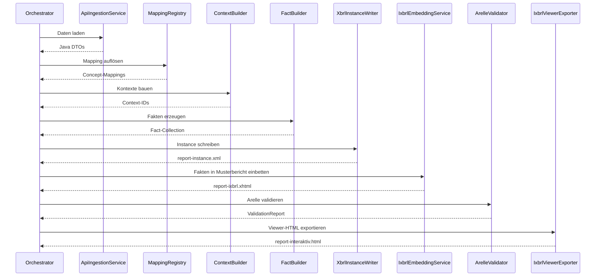

# Implementierungsleitfaden: Strukturierte ESRS-Berichte mit Java und XBRL

Stand: 2026-07-22

## Ziel dieses Dokuments

Dieses Dokument skizziert eine umsetzbare, technische End-to-End-Strategie, um auf Basis der vorliegenden ESRS-XBRL-Taxonomie strukturierte Berichte zu erzeugen.

Annahmen:

- Die Fachdaten kommen aus einer Schnittstelle und liegen im Java-System bereits als Objekte vor.
- Die Berichterstellung erfolgt in Java.
- Die technische und fachliche Validierung erfolgt mit Arelle.
- Aus einem Musterbericht wird zusätzlich ein valides XHTML mit Inline XBRL (iXBRL) erzeugt.
- Mit dem Arelle iXBRL-Viewer-Plugin wird das iXBRL-XHTML in eine interaktive HTML-Berichtssicht konvertiert.
- Grundlage ist die Taxonomie in diesem Repository.

Dieses Dokument ist bewusst ausführlich gehalten, damit es als Architektur- und Umsetzungsgrundlage für ein reales Projekt genutzt werden kann.

## Ist-Stand vs. Zielbild

Dieser Leitfaden beschreibt primär das **Zielbild** einer Implementierung.

Aktueller Ist-Stand im Repository:

- vorhanden: Taxonomiepaket, Analyse- und Konzeptdokumentation, Struktur-Skript,
- vorhanden: Maven-/Java-25-MVP-Pipeline fuer XBRL-Instanzierung und iXBRL-Erzeugung,
- vorhanden: Template-Basis (`templates/report-base.xhtml`, `templates/assets/report.css`, `templates/assets/report.js`) sowie Layout-Mapping,
- vorhanden: Arelle-CLI-Adapter fuer Validierung und Viewer-Export (inkl. Fallback-Ausgabe),
- offen: produktive Haertung fuer Zielumgebung, weitere schrittweise ESRS-Abdeckung und feste Bereitstellung des iXBRL-Viewer-Plugins in der Zielumgebung.

Das heißt: Die fachliche/technische Spezifikation ist umgesetzt und als MVP lauffaehig; der naechste Schritt ist die produktive Haertung und schrittweise Vollabdeckung.

Für die laufende Nachverfolgung des Umsetzungsstands wird ergänzend die Datei `CHECKLISTE_STATUS_XBRL_IXBRL_JAVA.md` als operativer Statusbericht verwendet.

## Ergebnisbild

Das Zielartefakt ist ein validierbarer XBRL-Berichtsdatensatz, der:

- Konzepte aus der ESRS-Taxonomie korrekt verwendet,
- alle Fakten mit korrektem Kontext, Zeitraum und Einheit ausprägt,
- bei Enumerationen nur zulässige Werte nutzt,
- bei Dimensionsangaben die erlaubten Achsen/Members verwendet,
- technisch mit Arelle erfolgreich validiert werden kann,
- als iXBRL-XHTML bei einer Datenannahmestelle bereitgestellt werden kann,
- als interaktive HTML-Berichtssicht publiziert werden kann,
- fachlich auf die ESRS-Referenzen zurückführbar bleibt.

Wichtig: In der Umsetzung entstehen damit zwei eng gekoppelte Ausgaben:

- klassische XBRL-Instanz für technische Prüfbarkeit,
- iXBRL-XHTML aus einem Musterbericht für Annahme und Darstellung.

Verbindliche Vorbedingung: Die Coding-KI erstellt und pflegt die Template-Basis fuer die Berichtsgenerierung selbst. Mindestartefakte:

- `templates/report-base.xhtml`
- `templates/assets/report.css`
- `templates/assets/report.js`
- `mapping/report-layout-map.json`

## Verbindliche Startphase mit fiktiver JSON

Bevor echte API-Daten verarbeitet werden, sollte die Pipeline mit einer fiktiven JSON-Testdatei gestartet werden. Diese Datei muss Datenpunkt und Ausprägung so enthalten, dass Mapping, Kontextbildung und Serialisierung vollständig durchlaufen werden.

Mindestens enthalten:

- fachliche Datenpunkt-ID oder Feldname,
- Zielkonzept (QName oder Mapping-Key),
- Ausprägung (Zahl, Text, Enumeration, Dimension-Member),
- Zeitraum (instant/duration),
- Einheit (bei numerischen Fakten),
- Entity-Identifier.

Mit dieser JSON wird der erste End-to-End-Test gefahren:

- fiktive JSON -> XBRL-Instanz -> Arelle,
- fiktive JSON -> iXBRL-XHTML (Musterbericht) -> Arelle -> Viewer-HTML.

## Architekturüberblick



## Technische Bausteine

### 1. Taxonomie-Verwendung

Verwende die Taxonomie lokal aus diesem Repository.

Wesentliche Einstiegspunkte:

- Vollständige Taxonomie: xbrl.efrag.org/taxonomy/esrs/2023-12-22/esrs_all.xsd
- Core-Einstieg: xbrl.efrag.org/taxonomy/esrs/2023-12-22/common/esrs_cor.xsd

Empfehlung:

- Für produktive Berichtserstellung und Validierung grundsätzlich den vollständigen Einstiegspunkt verwenden.
- Den Core-Einstieg nur für Metadatenexploration, Labeling und Referenzanalyse nutzen.

### 2. Java-Datenmodell (fachlich)

Baue ein internes Berichtsmodell als Zwischenebene zwischen API-DTOs und XBRL-Serialisierung.

Beispielhafte Modellklassen:

- ReportEnvelope
- ReportingEntity
- ReportingPeriod
- DisclosureFact
- DisclosureContext
- DimensionSelection
- UnitDefinition
- ValidationIssue
- InlinePlacement
- RenderingContext

Warum eine Zwischenebene wichtig ist:

- Entkopplung von API-Struktur und Taxonomiestruktur
- Stabilität bei API-Änderungen
- Zentralisierte Mappinglogik
- Einfachere Tests

### 3. Mapping-Schicht

Die Mapping-Schicht ist der wichtigste Teil des Systems.

Aufgaben:

- Zuordnung Java-Feld -> XBRL-Konzept
- Aufbau der XBRL-Kontexte
- Zuordnung von Einheiten
- Behandlung von Enumerationen
- Behandlung von Dimensionsangaben
- Normalisierung von Datums- und Zahlenwerten

Empfehlung für Mapping-Konfiguration:

- Mappingtabellen versioniert pflegen, nicht nur im Code hart verdrahten.
- Mapping je Taxonomieversion führen, z. B. map-esrs-2023-12-22.yaml.

Beispielhafte Mappingstruktur:

```yaml
fieldMappings:
  company.totalEnergyConsumption:
    concept: esrs:TotalEnergyConsumption
    type: numeric
    unit: kWh
    period: duration
    dimensions: []

  climate.scope1GrossEmissions:
    concept: esrs:GrossScope1GHGEmissions
    type: numeric
    unit: tCO2e
    period: duration
    dimensions:
      - axis: esrs:ConsolidationApproachAxis
        member: esrs:OperationalControlMember

  governance.corruptionPolicyExists:
    concept: esrs:PoliciesRelatedToCorruptionAndBribery
    type: enumeration
    enumerationDomain: esrs:YesNoDomain
```

## End-to-End-Prozess



## Versionierung

- auf dem lokalen Rechner ist git verfübar
- nutze es bitte für die Implementierung
- für jedes Feature erstellst du bitte einen eigenen Branch
- dann teste bitte die Implementierung auf deinem Branch
- nach erfolgreichem Testen merge bitte den Branch in den Main-Branch
- Tagge größere, geschlossene Fortschritte mit Versionsnummern, z. B. v1.0.0, v1.1.0
- wiederhole das Vorgehen für jedes neue Feature bis die Implementierung abgeschlossen ist

## Codierstandards

- Java 25 verwenden
- Maven als Build-Tool nutzen
- Coding Standards einhalten (z. B. Google Java Style Guide)
- Unit-Tests mit JUnit 5 implementieren

## Unit Tests

- JUnit 5 verwenden
- Testfälle für Mapping, Kontextbildung, Faktenerzeugung und Serialisierung implementieren
- Testdaten für verschiedene Szenarien bereitstellen (z. B. gültige und ungültige Datenpunkte, Enumerationen, Dimensionskombinationen)
- Testabdeckung regelmäßig prüfen und sicherstellen, dass kritische Pfade abgedeckt sind
- Integrationstests für End-to-End-Prozesse implementieren (fiktive JSON -> XBRL -> Arelle -> iXBRL -> Viewer)
- Testberichte in CI-Pipeline integrieren und als Qualitätsnachweis verwenden
- Testdaten sollten versioniert und reproduzierbar sein, um konsistente Ergebnisse zu gewährleisten
- Testfälle sollten auch negative Szenarien abdecken, um die Robustheit der Implementierung zu prüfen
- Tests bitte mit jacoco oder einem ähnlichen Tool auf Code Coverage prüfen und sicherstellen, dass kritische Pfade abgedeckt sind

## Detaillierter Implementierungsansatz in Java

### Phase 0: Musterbericht und fiktive JSON vorbereiten

Vor Produktivdaten zunächst eine stabile Testbasis erstellen:

- Musterbericht als XHTML-Template definieren,
- Template- und Asset-Basis im Projekt anlegen (`templates/report-base.xhtml`, `templates/assets/report.css`, `templates/assets/report.js`),
- Layout-Mapping fuer Platzhalter und Zielbereiche festlegen (`mapping/report-layout-map.json`),
- fiktive JSON mit Datenpunkt/Ausprägung anlegen,
- Platzhalter und Zielbereiche für Inline-Fakten markieren,
- ersten Pipeline-Lauf vollständig gegen Arelle und Viewer fahren.

### Phase 1: Datenaufnahme

Schnittstellenlayer:

- API Client lädt Rohdaten.
- DTOs repräsentieren Schnittstellenstruktur.
- Technische Prüfungen: Pflichtfelder, Datumsformate, numerische Parsbarkeit.

Empfehlungen:

- Alle Eingangsfehler früh klassifizieren.
- Keine direkte XBRL-Logik im API-Layer.

### Phase 2: Interne Harmonisierung

Erzeuge aus DTOs ein konsistentes internes Modell:

- Einheiten standardisieren, z. B. kWh, EUR, tCO2e.
- Zeitangaben in eindeutige Periodenobjekte überführen.
- Freitexte bereinigen.
- Enumerationsvorwerte normalisieren.

### Phase 3: Kontext-Engine

Jeder XBRL-Fakt benötigt einen Kontext.

Kontextkomponenten:

- entity (berichtendes Unternehmen)
- period (instant oder duration)
- dimensions (Axis/Member-Kombination)

Empfehlung:

- Kontext-Deduplizierung implementieren, damit identische Kontexte nur einmal im Dokument vorkommen.

Beispielcode:

```java
public record ContextKey(
    String entityScheme,
    String entityIdentifier,
    LocalDate startDate,
    LocalDate endDate,
    Map<String, String> dimensions
) {}
```

### Phase 4: Fakten-Erzeugung

Für jeden gemappten Datenpunkt:

- Konzeptname festlegen
- Kontext referenzieren
- Numerik formatieren
- Unit-Referenz setzen
- Präzision/Decimals-Regel anwenden

Beispielcode:

```java
public class XbrlFact {
    private String conceptQname;
    private String contextRef;
    private String unitRef;
    private String value;
    private String decimals;
}
```

### Phase 5: XML-Serialisierung

Generiere die XBRL-Instance als XML.

Empfehlung:

- Streaming-orientiert arbeiten, z. B. StAX, um Speicherverbrauch bei großen Berichten zu kontrollieren.
- Namespaces zentral verwalten.
- Deterministische Reihenfolge der Elemente wählen, um reproduzierbare Builds zu erhalten.

Beispielstruktur der Ausgabe:

- xbrli:xbrl
- schemaRef
- context-Blöcke
- unit-Blöcke
- Faktenelemente

### Phase 6: Validierung mit Arelle

Arelle übernimmt:

- XML/XBRL-Strukturvalidierung
- Taxonomie- und DTS-Auflösung
- Dimensions- und Enumerationsprüfungen
- Formulabasierte Regeln

Beispielhafter CLI-Ablauf:

```bash
arelleCmdLine \
  --file report-instance.xml \
  --validate \
  --disclosureSystem esef \
  --packages ./ \
  --logFile arelle-validation.log \
  --logFormat text
```

Hinweis:

- Die konkrete Optionenkombination hängt vom Zielregime und Arelle-Setup ab.
- In CI sollten Arelle-Logs maschinenlesbar geparst und als Build-Gate genutzt werden.

### Phase 7: iXBRL-XHTML aus Musterbericht erzeugen

Zusätzlich zur XBRL-Instanz wird ein valides XHTML mit Inline XBRL erstellt:

- Musterbericht laden,
- Text-/Tabellenbereiche mit Fakten verknüpfen,
- Inline-XBRL-Tags korrekt einbetten,
- technische XHTML-Gültigkeit und semantische XBRL-Konsistenz sicherstellen.

Ergebnisartefakt:

- report-ixbrl.xhtml

### Phase 8: Interaktive HTML via Arelle iXBRL-Viewer

Nach erfolgreicher iXBRL-Erzeugung:

- Arelle iXBRL-Viewer-Plugin auf report-ixbrl.xhtml anwenden,
- interaktive HTML-Sicht exportieren,
- Export als separates Veröffentlichungsartefakt speichern.

Beispielhafter Ablauf:

```bash
arelleCmdLine \
  --plugins iXBRLViewerPlugin \
  --file report-ixbrl.xhtml \
  --save-viewer report-interaktiv.html
```

Hinweis: Konkrete Parameter können je Arelle-Version/Plugin-Distribution variieren; daher CLI-Adapter konfigurierbar implementieren.

## Umgang mit Enumerationen und Dimensionsdaten

### Enumerationen

Regeln:

- Nur taxonomiekonforme Werte zulassen.
- Keine freie Übersetzung in technische Wertefelder.
- Label-Anzeige und technischer Member-Wert strikt trennen.

### Dimensionsdaten

Regeln:

- Axis und Member strikt aus Taxonomie ableiten.
- Ungültige Axis/Member-Kombinationen früh blockieren.
- Bei typed dimensions Datentyp- und Strukturregeln prüfen.

Beispiel:

- Ein Fakt darf nur mit dem dafür vorgesehenen Achsenset auftreten.
- Wird ein unzulässiger Member gesetzt, muss der Builder den Fakt ablehnen oder als Fehler melden.

## Empfohlene Java-Projektstruktur

```text
src/main/java
  /api
  /mapping
  /model
  /xbrl
    /context
    /fact
    /serializer
    /taxonomy
  /ixbrl
    /template
    /embedding
    /viewer
  /validation
    /arelle
  /orchestration

src/main/resources
  /taxonomy
  /mappings
  /units
  /templates
  /testdata
```

## Vorschlag für zentrale Komponenten

- ApiIngestionService
- MappingRegistry
- TaxonomyLookupService
- ContextBuilder
- UnitRegistry
- FactBuilder
- XbrlInstanceWriter
- IxbrlTemplateRenderer
- IxbrlEmbeddingService
- ArelleValidator
- IxbrlViewerExporter
- ValidationReportParser
- ReportingPipelineOrchestrator

## Orchestrierung als Pipeline



## Fehlerbehandlung und Qualitätssicherung

### Fehlerkategorien

- Input-Fehler: API-Daten unvollständig oder ungültig
- Mapping-Fehler: Kein Konzept für Datenfeld vorhanden
- Kontext-Fehler: Perioden/Dimensionen inkonsistent
- Serialisierungsfehler: XML unvollständig oder fehlerhaft
- iXBRL-Embedding-Fehler: Fakten nicht korrekt im XHTML verankert
- Template-Fehler: Musterbericht-Struktur passt nicht zu Mapping/Platzhaltern
- Taxonomiefehler: Nicht auflösbare Referenzen
- Validierungsfehler: Arelle meldet Regelverstöße
- Viewer-Exportfehler: iXBRL-Viewer-Konvertierung schlägt fehl

### Qualitätsmaßnahmen

- Unit-Tests auf Mappingregeln
- Snapshot-Tests auf erzeugte XBRL-Fragmente
- Integrationstests mit vollständigem Pipeline-Lauf
- Goldene Referenzberichte für Regressionstests
- CI-Gate auf Arelle-Fehlerstufe
- CI-Gate auf erfolgreiche iXBRL-Erzeugung und Viewer-Export

## Konkrete Teststrategie

- Fruehtest mit fiktiver JSON: Datenpunkt/Ausprägung -> XBRL -> Arelle.
- Fruehtest iXBRL: fiktive JSON -> Musterbericht-XHTML -> iXBRL -> Arelle.
- Mapping-Tests: Für jedes kritische Feld prüfen, ob korrekter QName und Kontexttyp entstehen.
- Enumeration-Tests: Zulässige Werte akzeptieren, unzulässige strikt ablehnen.
- Dimensions-Tests: Gültige Axis/Member-Kombinationen durchlassen, ungültige blockieren.
- End-to-End-Test: API-Beispieldaten -> XBRL -> Arelle -> erwartetes Ergebnis.
- End-to-End-Test iXBRL: API-Beispieldaten -> iXBRL-XHTML -> Arelle -> erwartetes Ergebnis.
- Viewer-Test: iXBRL-XHTML -> interaktive HTML-Ausgabe.
- Stabilitätstest: Gleiches Inputobjekt erzeugt byte-stabilen oder semantisch stabilen Output.

## Betriebsmodell

### Batch-orientierte Erzeugung

Geeignet, wenn Berichte periodisch erstellt werden.

- Eingangsdatenschnitt zu festem Stichtag
- Verarbeitung als Job
- Validierung (XBRL + iXBRL) und Freigabe als Gate
- Ablage mit Version und Prüfreport
- Ablage von report-instance.xml, report-ixbrl.xhtml und report-interaktiv.html

### Event-orientierte Vorvalidierung

Geeignet, wenn Daten laufend ankommen.

- Vorvalidierung bei Dateneingang
- Endgültige Berichtsgenerierung als Closing-Job

## Performance-Hinweise

- Kontext-Deduplizierung reduziert Dokumentgröße deutlich.
- Streaming XML-Schreiben vermeidet hohe RAM-Last.
- Taxonomie-Metadaten cachen, nicht pro Fakt neu auflösen.
- Arelle-Aufrufe bei Massendaten parallelisieren, aber Logik deterministisch halten.

## Governance und Änderungsmanagement

Da Taxonomien versioniert sind, sollte jedes Release dokumentieren:

- verwendete Taxonomieversion
- verwendete Mappingversion
- Arelle-Version
- iXBRL-Musterbericht-Version
- iXBRL-Viewer-Plugin-Version
- Datum und Ergebnis der Validierung

Empfohlene Release-Metadaten:

- reportVersion
- taxonomyVersion
- mappingVersion
- validatorVersion
- templateVersion
- viewerPluginVersion
- validationTimestamp
- validationOutcome

## Sicherheits- und Compliance-Aspekte

- Herkunft der API-Daten protokollieren.
- Transformationsschritte revisionssicher loggen.
- Nachvollziehbarkeit von Fakt -> Quellfeld sicherstellen.
- Validierungsprotokolle unveränderbar archivieren.

## Minimaler Umsetzungspfad (MVP)

1. Ein begrenztes Set relevanter ESRS-Konzepte auswählen.
2. Fiktive JSON mit Datenpunkt/Ausprägung für diese Konzepte erstellen.
3. Mapping für diese Konzepte vollständig implementieren.
4. XBRL-Instance mit diesen Fakten erzeugen.
5. iXBRL-XHTML aus Musterbericht erzeugen.
6. Arelle-Validierung in lokaler Pipeline integrieren.
7. Viewer-Konvertierung in interaktive HTML integrieren.
8. Fehlerbehandlung und Reporting standardisieren.
9. Schrittweise auf volle Taxonomieabdeckung erweitern.

## Ausbaustufen nach MVP

- Automatischer Import von Taxonomie-Metadaten in Mapping-Registry
- UI für Mappingpflege
- Fachregel-Engine vor Arelle
- Delta-Validierung zwischen Berichtsversionen
- Mehrsprachige Label-Nutzung für Fachanwenderansichten
- Template-Varianten für unterschiedliche Berichtstypen
- Automatisierte visuelle Qualitätsprüfungen für iXBRL-Rendering

## Praktischer Merksatz

Für eine robuste Lösung braucht es vier sauber getrennte Schichten:

- Datenbeschaffung und Normalisierung in Java,
- taxonomiegesteuerte Fakt- und Kontextbildung,
- iXBRL-Einbettung in einen Musterbericht als valide XHTML-Ausgabe,
- unabhängige Endvalidierung und Viewer-Erzeugung mit Arelle als Release-Gate.

Wenn diese Trennung konsequent umgesetzt wird, ist die Berichterstellung reproduzierbar, erweiterbar und regulatorisch belastbar.
