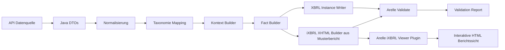

# KI-Instruktionen: Valide XBRL-Berichte mit Java 25 erstellen

Stand: 2026-08-14

Aktualisiert nach dem aktuellen Stand von `main` mit den jüngsten Visualisierungs- und Import-Optimierungen. Die Arbeitsaufforderungen bleiben gültig, aber die Vorgaben sind auf den aktuellen Projektkontext abgestimmt.

## Zweck

Diese Datei ist eine direkte Arbeitsanweisung fuer eine Coding-KI. Ziel ist die technische Umsetzung einer Java-25-Pipeline zur Erzeugung valider ESRS-XBRL-Berichte gemaess dem Implementierungsleitfaden in [IMPLEMENTIERUNGSLEITFADEN_JAVA_XBRL_ESRS.md](IMPLEMENTIERUNGSLEITFADEN_JAVA_XBRL_ESRS.md).

## Steuerung ueber Status-Checkliste

Als zentrales Steuerungsartefakt soll die KI zusaetzlich die Datei `CHECKLISTE_STATUS_XBRL_IXBRL_JAVA.md` verwenden.

Pflicht fuer die KI pro Umsetzungsiteration:

- Status vor Start lesen,
- bearbeitete Punkte auf aktualisierten Stand setzen,
- offene Blocker mit kurzer Ursache dokumentieren,
- naechste priorisierte Schritte explizit markieren.

Dadurch bleibt die Umsetzung nachvollziehbar und fuer Fach- wie Technikseite transparent.

## Verbindliche Ziele

Die KI soll ein System erzeugen, das:

- ESRS-relevante API-Daten (Java-Objekte) in XBRL-Fakten ueberfuehrt,
- valide XBRL-Instanzen erzeugt,
- Enumerationen und Dimensionen taxonomiekonform behandelt,
- Arelle als externes Validierungsgate nutzt,
- aus den XBRL-Daten ein valides XHTML mit Inline XBRL (iXBRL) auf Basis eines Musterberichts erzeugt,
- mit dem Arelle iXBRL-Viewer-Plugin eine interaktive HTML-Berichtssicht erzeugt,
- reproduzierbare und testbare Ergebnisse liefert.

## Verbindliche Rahmenbedingungen

- Programmiersprache: Java 25
- Build: Maven
- Taxonomiequelle: lokale Dateien aus diesem Repository
- Validierung: Arelle CLI
- Zielausgabe zusaetzlich: iXBRL-konformes XHTML fuer Datenannahmestellen
- Fokus: Korrektheit vor Performance
- Berichtsvorlagen und Assets muessen vom Coding-Agenten selbst erstellt und gepflegt werden

## Nicht-Ziele

- Kein UI zuerst bauen
- Keine direkte Kopplung der API-DTOs an XBRL-Serialisierung
- Keine freien Werte bei kontrollierten Enumerationen
- Keine Umgehung des Arelle-Gates

## Verbindliche Startphase mit fiktiver JSON

Bevor echte API-Daten verarbeitet werden, muss die KI zwingend mit einer **fiktiven JSON-Testdatei** starten. Diese Datei dient zur kontrollierten Erprobung der XBRL-Instanziierung und der Arelle-Validierung.

Die fiktive JSON muss mindestens enthalten:

- Datenpunkt-ID bzw. fachliches Feld
- Zielkonzept (QName oder Mapping-Key)
- Auspraegung (z. B. Enumeration, Dimension-Member, Text oder Zahl)
- Zeitraum (instant oder duration)
- Einheit (bei numerischen Fakten)
- Entity-Identifier

Ziel dieser Startphase:

- Mappinglogik frueh verifizieren
- Kontextbildung (entity/period/dimensions) testen
- XBRL-Instanziierung technisch pruefen
- Arelle-Validierung bereits im fruehen Entwicklungsstadium absichern
- iXBRL-Einbettung in ein Musterbericht-XHTML frueh testen
- Viewer-Konvertierung in interaktive HTML frueh testen

Erst wenn die fiktive JSON stabil und valide verarbeitet wird, darf auf echte API-Datenquellen erweitert werden.

## Pflicht-Referenzen im Repository

Die KI muss diese Ressourcen kennen und verwenden:

- [META-INF/taxonomyPackage.xml](META-INF/taxonomyPackage.xml)
- [META-INF/catalog.xml](META-INF/catalog.xml)
- [xbrl.efrag.org/taxonomy/esrs/2023-12-22/esrs_all.xsd](xbrl.efrag.org/taxonomy/esrs/2023-12-22/esrs_all.xsd)
- [xbrl.efrag.org/taxonomy/esrs/2023-12-22/common/esrs_cor.xsd](xbrl.efrag.org/taxonomy/esrs/2023-12-22/common/esrs_cor.xsd)
- [xbrl.efrag.org/taxonomy/esrs/2023-12-22/common/references/ref_esrs.xml](xbrl.efrag.org/taxonomy/esrs/2023-12-22/common/references/ref_esrs.xml)

## Zielarchitektur (Pflicht)



### Schichten

- ingestion: API lesen und DTOs erstellen
- normalization: Werte standardisieren (Datum, Numerik, Codes)
- mapping: Java-Feld auf XBRL-Konzept mappen
- xbrl-model: Kontext, Einheit, Fakt-Strukturen
- writer: XBRL XML serialisieren
- ixbrl: Fakten in Musterbericht als Inline XBRL in XHTML einbetten
- validation: Arelle aufrufen und Ergebnis parsen
- viewer: Arelle iXBRL-Viewer-Export orchestrieren
- orchestration: End-to-End Ablauf steuern

## Verbindlicher iXBRL-Track fuer Datenannahmestellen

Die KI muss neben der klassischen XBRL-Instanz einen zweiten Ausgabepfad implementieren:

1. Musterbericht (XHTML-Template) laden.
2. Gemappte Fakten als Inline-XBRL-Tags einbetten.
3. Valides XHTML plus iXBRL-Struktur erzeugen.
4. Arelle-Validierung fuer das iXBRL-Dokument ausfuehren.
5. Arelle iXBRL-Viewer-Plugin nutzen und interaktive HTML-Ausgabe erzeugen.

Pflicht: Dieser iXBRL-Track ist kein optionales Add-on, sondern Bestandteil der Zielimplementierung.

## Aktuelle Paketempfehlungen fuer Java 25

Hinweis: Die KI soll immer stabile aktuelle Versionen einsetzen (nicht veraltete APIs). Wenn Versionskonflikte auftreten, sollen BOMs priorisiert werden.

### XML/XSD Kern (bevorzugt JDK + gezielte Libraries)

- JDK 25 Standard-APIs:
  - javax.xml.stream (StAX)
  - javax.xml.parsers (DOM/SAX Factory)
  - javax.xml.validation (XSD-Validierung)
  - javax.xml.transform
- Empfehlung fuer robuste StAX-Implementierung:
  - com.fasterxml.woodstox:woodstox-core
- Optional fuer JAXB-Binding (falls verwendet):
  - jakarta.xml.bind:jakarta.xml.bind-api (4.x)
  - org.glassfish.jaxb:jaxb-runtime (4.x)

### Daten und Serialisierung

- com.fasterxml.jackson.core:jackson-databind
- com.fasterxml.jackson.datatype:jackson-datatype-jsr310

### Logging

- org.slf4j:slf4j-api
- ch.qos.logback:logback-classic

### Tests

- org.junit.jupiter:junit-jupiter
- org.assertj:assertj-core

### Optional fuer CLI-Orchestrierung

- info.picocli:picocli

### Versionsstrategie (Pflicht)

- Keine Legacy-Javax-Altbibliotheken einmischen, wenn Jakarta-Varianten im Einsatz sind.
- Abhaengigkeiten ueber BOM oder zentrale Version-Properties steuern.
- Build mit Dependency-Updates automatisierbar halten (z. B. Renovate/Dependabot).

## Sicherheitsvorgaben fuer XML-Verarbeitung (Pflicht)

Die KI muss XXE- und Entity-Angriffe unterbinden:

- Externe Entities deaktivieren
- DTD-Verarbeitung deaktivieren (wo nicht benoetigt)
- Sichere Parser-Features aktivieren

Beispielprinzip:

- setFeature(`"http://apache.org/xml/features/disallow-doctype-decl"`, true)
- setFeature(`"http://xml.org/sax/features/external-general-entities"`, false)
- setFeature(`"http://xml.org/sax/features/external-parameter-entities"`, false)

## Modellierungsregeln (Pflicht)

### 1. Interne Zwischenmodelle verwenden

Direkte API-DTO -> XBRL XML Serialisierung ist verboten.

Pflichtmodelle:

- ReportingEnvelope
- ReportingEntity
- ReportingPeriod
- ContextKey
- UnitDef
- FactValue
- XbrlFact

### 2. Kontext-Deduplizierung

Identische Kontexte muessen nur einmal erzeugt werden.

Kontextschluessel mindestens aus:

- entity identifier
- period start/end oder instant
- dimensions map

### 3. Enumeration-Handling

- Nur taxonomiekonforme Werte zulassen
- Keine freien Uebersetzungen als technische Werte
- Label und technischer Member-Wert strikt trennen

### 4. Dimensions-Handling

- Nur zulaessige Axis/Member-Kombinationen
- Typed dimensions strikt validieren
- Ungueltige Kombinationen frueh als Fehler melden

## Umsetzungsaufgaben fuer die KI

Die KI soll in dieser Reihenfolge arbeiten:

1. Projektgeruest und Pakete anlegen
2. Fiktive JSON-Testdaten (Datenpunkt und Auspraegung) erstellen
3. DTO- und Domain-Modelle anlegen
4. Mapping-Registry (konfigurierbar) implementieren
5. Template-Basis erstellen (`templates/report-base.xhtml`, `templates/assets/report.css`, `templates/assets/report.js`)
6. Layout-Mapping erstellen (`mapping/report-layout-map.json`)
7. Kontext-Builder mit Deduplizierung implementieren
8. Fact-Builder implementieren
9. XBRL-Writer mit StAX implementieren
10. iXBRL-XHTML Builder auf Basis eines Musterberichts implementieren
11. Arelle-Validator (CLI Adapter) implementieren
12. Validation-Report Parser implementieren
13. Arelle iXBRL-Viewer-Plugin Integration implementieren
14. End-to-End Orchestrator implementieren
15. Tests und Beispielpipeline bereitstellen

## Pflicht-Dateien, die die KI erzeugen soll

Mindestens:

- Mapping-Konfiguration (z. B. YAML/JSON)
- `mapping/report-layout-map.json`
- Fiktive JSON-Testdatei mit Datenpunkt und Auspraegung fuer einen Bericht
- Beispiel-Inputdaten (Mock API Payload)
- erzeugte Beispiel-XBRL-Instanz
- `templates/report-base.xhtml`
- `templates/assets/report.css`
- `templates/assets/report.js`
- erzeugtes iXBRL-XHTML fuer die Datenannahmestelle
- Arelle-Validierungsreport
- interaktive HTML-Ausgabe aus dem Arelle iXBRL-Viewer-Plugin
- Testfaelle fuer Mapping, Enumeration, Dimensionen

## Qualitaetsgate (Pflicht)

Ein Bericht gilt nur als erfolgreich, wenn:

- technische Generierung ohne Exception durchlaeuft,
- Arelle-Validierung keine kritischen Fehler liefert,
- alle Pflichtfakten vorhanden sind,
- Enumerationen und Dimensionen regelkonform sind,
- das iXBRL-XHTML aus dem Musterbericht valide erzeugt wurde,
- die Viewer-Konvertierung in interaktive HTML erfolgreich war,
- Ergebnis inklusive Versionen nachvollziehbar protokolliert ist.

## Arelle-Integration

Die KI soll einen robusten Prozess zum Aufruf von Arelle implementieren.

Beispielkommando:

```bash
arelleCmdLine \
  --file report-instance.xml \
  --validate \
  --packages ./ \
  --logFile arelle-validation.log \
  --logFormat text
```

Pflichtverhalten:

- Exit-Code auswerten
- Log parsen
- Fehlerklassen bilden (fatal/error/warning)
- Build bei Fehlern stoppen

### Arelle iXBRL-Viewer-Integration (Pflicht)

Die KI muss zusaetzlich einen Viewer-Schritt fuer iXBRL umsetzen.

Beispielkommando (Arelle-Installation abhaengig):

```bash
arelleCmdLine \
  --plugins iXBRLViewerPlugin \
  --file report-ixbrl.xhtml \
  --save-viewer report-interaktiv.html
```

Wichtiger Hinweis fuer die KI:

- CLI-Optionen koennen je Arelle-Version und Plugin-Distribution leicht variieren.
- Die Implementierung muss daher plugin-faehig und konfigurierbar sein.
- Pflicht ist ein automatisierter Schritt, der aus iXBRL-XHTML eine interaktive HTML-Sicht erzeugt.

## Teststrategie (Pflicht)

- Mapping-Tests fuer kritische Felder
- Enumeration-Tests (valid/invalid)
- Dimensions-Tests (valid/invalid)
- End-to-End-Test: API -> XBRL -> Arelle
- End-to-End-Test iXBRL: API -> iXBRL XHTML (Musterbericht) -> Arelle
- Viewer-Test: iXBRL XHTML -> interaktive HTML via Arelle Plugin
- Regressionstest mit Referenzdaten
- Fruehtest mit fiktiver JSON: Datenpunkt/Auspraegung -> XBRL-Instanz -> Arelle

## Definition of Done

Die Umsetzung ist fertig, wenn:

- ein kompletter Pipeline-Lauf reproduzierbar funktioniert,
- ein Beispielbericht erfolgreich validiert,
- ein iXBRL-XHTML auf Basis des Musterberichts erfolgreich validiert,
- eine interaktive HTML-Berichtssicht aus dem iXBRL erzeugt wurde,
- alle Pflichttests gruen sind,
- technische Dokumentation zur Ausfuehrung vorliegt,
- Konfigurationen fuer Taxonomieversion und Mappingversion trennbar sind.

## Output-Format fuer die KI

Die KI soll pro Iteration liefern:

1. Welche Dateien wurden erstellt/geaendert
2. Welche Architekturentscheidung wurde getroffen
3. Welche Tests hinzugefuegt wurden
4. Ergebnis des Arelle-Laufs
5. Offene Risiken oder Folgeaufgaben

## Wichtige Implementierungshinweise

- UTF-8 durchgaengig verwenden
- Deterministische Reihenfolge bei XML-Ausgabe einhalten
- Namespace-Management zentralisieren
- Keine stillen Fallbacks bei Mappingfehlern
- Fehler frueh und explizit machen

## Kurzauftrag fuer eine Coding-KI

Baue mit Java 25 eine produktionsnahe Pipeline zur Erzeugung valider ESRS-XBRL-Berichte aus API-Datenobjekten. Nutze aktuelle stabile XML/XSD-Bibliotheken, setze sichere Parser-Konfiguration, implementiere taxonomiekonformes Mapping fuer Konzepte, Kontexte, Dimensionen und Enumerationen, serialisiere XBRL per StAX und validiere jeden Lauf verpflichtend mit Arelle.
