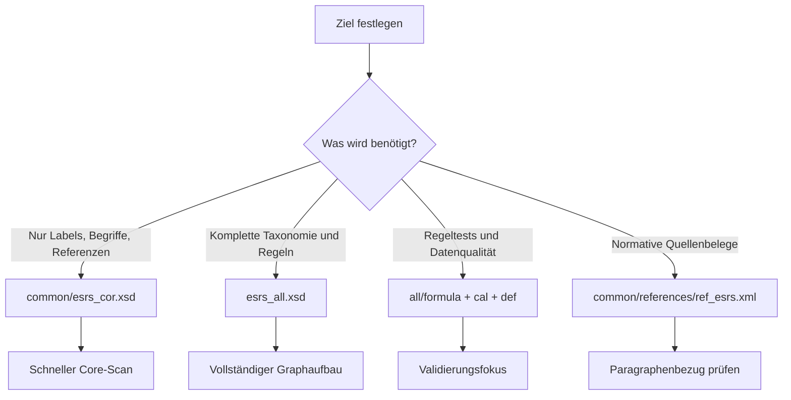
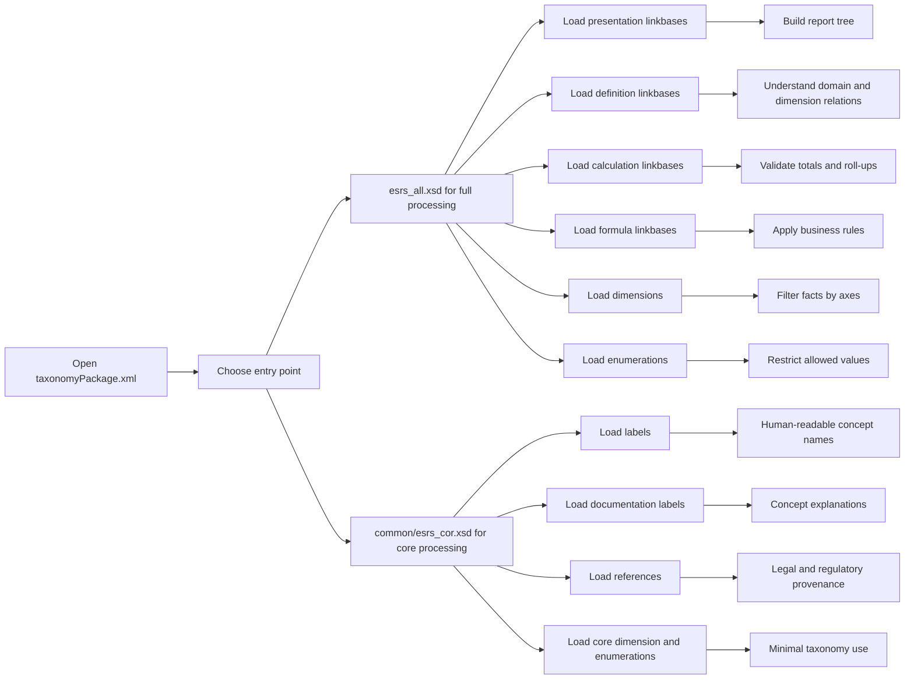
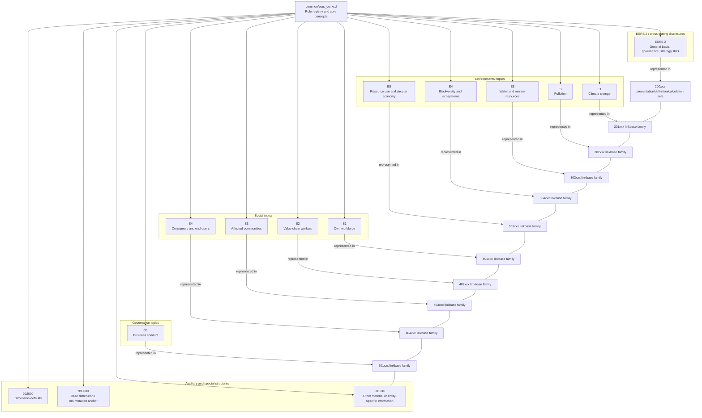
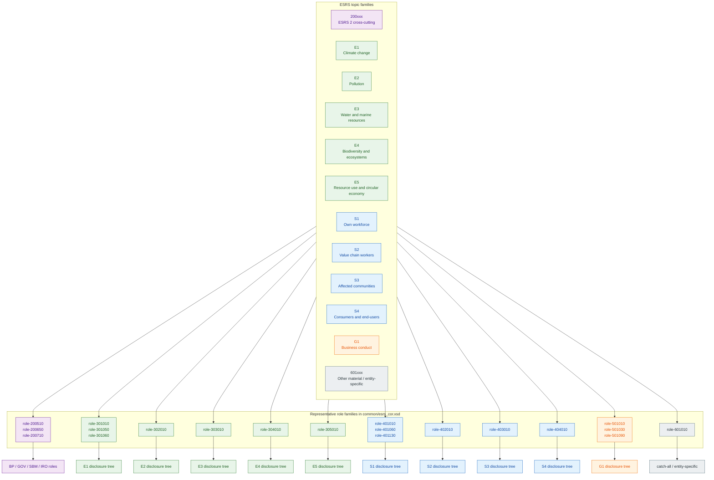

# Projektstruktur-Analyse

Stand: 2026-08-14

Aktualisiert nach dem aktuellen Git-Stand von `main`, einschließlich der letzten Optimierungen bei Imports und Visualisierungsseiten.

## Kurzfazit

Dieses Projekt ist ein XBRL-Taxonomy-Paket von EFRAG für die ESRS Set-1 Taxonomy. Die Struktur ist klar in ein Paket-Metadatenverzeichnis und einen versionierten Taxonomiebaum unter `xbrl.efrag.org/taxonomy/esrs/2023-12-22/` aufgeteilt.

Auf technischer Ebene ist das Projekt eine offline nutzbare, versionierte XBRL-Taxonomie mit zwei Einstiegspunkten: einem vollständigen Paket für die Gesamttaxonomie und einem reduzierten Core-Einstiegspunkt für Grundkonzepte, Labels und References.

## Dokumentationslandkarte

Für eine schnelle Orientierung über die vorhandenen Markdown-Dokumente:

- `PROJEKTSTRUKTUR.md`: Struktur, Inventur, fachlich/technische Einordnung, Dateiprojektion und Review-Checkpunkte.
- `TECHNISCHE_GRUNDLAGEN.md`: tiefes Architekturverständnis zu XML/XSD/Namespaces/Linkbases und Verarbeitungslogik.
- `GLOSSAR_XBRL_ESRS.md`: kompaktes Nachschlagewerk zentraler XBRL-/ESRS-Begriffe.
- `IMPLEMENTIERUNGSLEITFADEN_JAVA_XBRL_ESRS.md`: technischer Bauplan für Java-Implementierung inklusive XBRL, iXBRL, XHTML und Viewer.
- `KI_INSTRUKTIONEN_XBRL_JAVA25.md`: konkrete Umsetzungsinstruktionen für eine Coding-KI (Java 25, Arelle, iXBRL).
- `CHECKLISTE_STATUS_XBRL_IXBRL_JAVA.md`: laufender Statusbericht (Soll/Ist) über Dokuabdeckung, Implementierungsstand und nächste Schritte.

Verbindlich fuer die Umsetzung: Die Coding-KI erstellt und pflegt die Berichtsvorlagen selbst und nutzt sie als Basis fuer die Generierung. Erwartete Mindestartefakte sind:

- `templates/report-base.xhtml`
- `templates/assets/report.css`
- `templates/assets/report.js`
- `mapping/report-layout-map.json`

## Beobachtete Struktur

- `META-INF/` enthält die Paketmetadaten.
- `META-INF/taxonomyPackage.xml` beschreibt das Taxonomy Package, den Publisher, die Version und die Entry Points.
- `META-INF/catalog.xml` leitet externe URIs auf die lokalen Dateien im versionierten Taxonomiebaum um.
- `xbrl.efrag.org/taxonomy/esrs/2023-12-22/` ist der eigentliche Fachinhalt der Taxonomie.
- Der Haupt-Einstiegspunkt ist `esrs_all.xsd`.
- Der zweite Einstiegspunkt ist `common/esrs_cor.xsd`.

## Projektinventur

- Top-Level-Verzeichnisse: `META-INF/` und `xbrl.efrag.org/`.
- `all/linkbases/` enthält 251 Dateien.
- `all/formula/` enthält 4 Dateien.
- `all/dimensions/` enthält 2 Dateien.
- `all/enumerations/` enthält 57 Dateien.
- `common/labels/` enthält 3 Dateien.
- `common/references/` enthält 1 Datei.
- Die Taxonomie ist damit stark modularisiert und sehr fein in fachliche Teilbereiche zerlegt.

## Verteilung der Linkbase-Typen

- `pre_esrs*` macht mit 124 Dateien den größten Teil der Linkbases aus.
- `def_esrs*` folgt mit 118 Dateien und bildet den semantischen Beziehungs- und Dimensionsraum ab.
- `cal_esrs*` umfasst 9 Dateien und deckt die rechnerischen Summen- und Roll-up-Beziehungen ab.
- Die Verteilung zeigt, dass diese Taxonomie stark auf Anzeige- und Bedeutungsstrukturen ausgelegt ist und nur an ausgewählten Stellen echte Berechnungen enthält.

## Fachliche Einordnung

- Das Paket ist auf die European Sustainability Reporting Standards (ESRS) bezogen.
- Es gibt einen vollständigen Einstiegspunkt mit allen Themen und Linkbases.
- Es gibt einen Core-Einstiegspunkt für Konzepte, Labels und References.
- Die Unterstruktur `all/` trennt die fachlichen Erweiterungen in `dimensions/`, `enumerations/`, `formula/` und `linkbases/`.
- Die Unterstruktur `common/` enthält gemeinsame Ressourcen wie das Core-Schema, Labels und References.
- Die Datei- und Ordnernamen sind nach ESRS-Themen- oder Datapoint-Codes organisiert, nicht nach frei gewählten Fachnamen.

## Fachsicht, Techniksicht und gemeinsame Schnittmenge

Die Taxonomie wird in der Praxis aus zwei Blickwinkeln gelesen, die sich ergänzen.

### Eher Fachsicht

- Welche ESRS-Anforderung fachlich hinter einem Datenpunkt steht.
- Welche Angabe im Bericht inhaltlich gefordert ist (z. B. Klimaziel, Policy, Kennzahl).
- Welche Ausprägungen inhaltlich zulässig sind (z. B. Auswahlwerte bei Enumerationen).
- Welche Referenzstelle im ESRS-Regelwerk als Begründung dient.

Typische Arbeitsobjekte aus Fachsicht:

- Themenblöcke und Offenlegungspflichten,
- Labels und Dokumentationslabels zur fachlichen Lesbarkeit,
- References als Verbindung zur Normquelle.

### Eher Techniksicht

- Wie ein Datenpunkt technisch modelliert ist (Konzept, Typ, Kontext, Einheit).
- Wie Beziehungen in Linkbases umgesetzt werden (presentation, definition, calculation).
- Wie Dimensionen und Enumerationen technisch erzwungen werden.
- Wie Validierungsregeln (Formeln) und Tooling (z. B. Arelle) aufgesetzt sind.

Typische Arbeitsobjekte aus Techniksicht:

- Entry Points und Imports,
- XML/XSD-Strukturen, Namespaces und URI-Auflösung,
- Kontext-, Unit- und Fact-Instanziierung,
- technische Validierungs- und Build-Pipeline.

### Gemeinsame Schnittmenge

Die gemeinsame Schnittmenge ist das verbindliche Mapping zwischen fachlicher Aussage und technischer Repräsentation:

- fachlicher Berichtssachverhalt -> konkretes Taxonomie-Konzept,
- fachlich erlaubte Ausprägung -> zulässiger Member/Enumeration-Wert,
- fachlicher Zeitraum/Scope -> technischer Kontext (period + dimensions),
- fachliche Nachvollziehbarkeit -> reference-Verknüpfung im XBRL-Modell.

### Wo der Austausch stattfindet

Der wichtigste Austauschpunkt zwischen Fachbereich und Technik liegt in klaren Übergabeobjekten:

1. Mapping-Tabellen: Fachfeldnamen, ESRS-Bezug, Zielkonzept, Datentyp, Einheit, Dimensionen.
2. Validierungsregeln: Fachliche Muss-/Kann-Regeln werden in technische Prüfungen übersetzt.
3. Testfälle: Fachliche Beispieldaten (inkl. Grenzfälle) werden als technische Testdaten umgesetzt.
4. Abnahmeberichte: Arelle-Ergebnisse werden gemeinsam fachlich und technisch interpretiert.

Kurz gesagt: Die Fachseite definiert Bedeutung und Erwartung, die Technikseite garantiert korrekte, valide und reproduzierbare Umsetzung im XBRL-Format.

### Projektion auf die konkreten Projektdateien

| Verzeichnis/Datei | Eher Fachsicht | Eher Techniksicht | Gemeinsamer Austausch |
| --- | --- | --- | --- |
| `xbrl.efrag.org/taxonomy/esrs/2023-12-22/common/references/ref_esrs.xml` | Sehr hoch: fachliche Rückverfolgbarkeit zu ESRS-Quellen | Mittel: technische Arc/Role-Verknüpfung | Sehr hoch: Prüfen, ob Konzept und Normstelle korrekt zusammenpassen |
| `xbrl.efrag.org/taxonomy/esrs/2023-12-22/common/labels/` (`lab_*`, `doc_*`, `gla_*`) | Hoch: fachliche Lesbarkeit und Begriffsklarheit | Mittel: Resource-Struktur, `xml:lang`, Rollen | Hoch: Abstimmung, ob Labeltext die gewünschte fachliche Bedeutung trifft |
| `xbrl.efrag.org/taxonomy/esrs/2023-12-22/all/enumerations/` | Hoch: zulässige fachliche Ausprägungen | Hoch: technische Durchsetzung der Wertelisten | Sehr hoch: Entscheidung, welche fachlichen Auswahlwerte technisch gemappt werden |
| `xbrl.efrag.org/taxonomy/esrs/2023-12-22/all/dimensions/` | Mittel bis hoch: fachliche Achsenlogik (Scope, Segment etc.) | Hoch: Axis/Member-Modellierung und Kontextregeln | Sehr hoch: Klärung, wann ein Fakt welche Dimension tragen muss |
| `xbrl.efrag.org/taxonomy/esrs/2023-12-22/all/linkbases/pre_*` | Mittel: fachliche Berichtsgliederung erkennbar | Hoch: technische Hierarchie-Implementierung | Hoch: Abstimmung, ob fachliche Struktur im Bericht korrekt gespiegelt ist |
| `xbrl.efrag.org/taxonomy/esrs/2023-12-22/all/linkbases/def_*` | Hoch: fachliche Semantik und Beziehungen | Hoch: technische Domänen-/Dimensionsbeziehungen | Sehr hoch: gemeinsame Klärung semantischer Zulässigkeit |
| `xbrl.efrag.org/taxonomy/esrs/2023-12-22/all/linkbases/cal_*` | Mittel: fachliche Summenlogik | Hoch: technische Rechenbeziehungen | Hoch: Abgleich fachlicher Rechenregeln mit technischer Validierbarkeit |
| `xbrl.efrag.org/taxonomy/esrs/2023-12-22/all/formula/` | Hoch: Muss-/Kann- und Konsistenzlogik fachlich relevant | Sehr hoch: technische Validierungsregeln | Sehr hoch: zentrale Übersetzung fachlicher Regeln in maschinenprüfbare Logik |
| `xbrl.efrag.org/taxonomy/esrs/2023-12-22/esrs_all.xsd` | Mittel: vollständiger fachlicher Scope | Sehr hoch: primärer technischer Einstiegspunkt | Hoch: Entscheidung, wann Full-Entry für Validierung verwendet wird |
| `xbrl.efrag.org/taxonomy/esrs/2023-12-22/common/esrs_cor.xsd` | Mittel: Core-Begriffe/Grundmodell | Sehr hoch: Core-Entry und Rollenmodell | Hoch: Abstimmung, ob Core für Analyse reicht oder Full benötigt wird |
| `META-INF/taxonomyPackage.xml` | Niedrig bis mittel: Paketinhalt/Entry-Point-Sicht | Sehr hoch: Packaging- und Metadatensteuerung | Mittel: Klarheit, welcher Entry Point für welchen fachlichen Zweck gilt |
| `META-INF/catalog.xml` | Niedrig: fachlich indirekt relevant | Sehr hoch: Offline-URI-Auflösung | Mittel: wichtig für gemeinsame Reproduzierbarkeit in Test/Abnahme |

Praktisch bedeutet das:

- **Fachlastig** sind vor allem `common/references/`, `common/labels/`, `all/enumerations/` und die inhaltliche Seite von `def_*`/`formula`.
- **Techniklastig** sind vor allem `META-INF/`, Entry-Points (`*.xsd`) und die Implementierungsseite von Linkbases/Formeln.
- **Gemeinsame Kernzone** ist die Kombination aus `all/dimensions/`, `all/enumerations/`, `all/formula/`, `all/linkbases/def_*` und `common/references/ref_esrs.xml`.

Dort findet der regelmäßigste Austausch statt, weil genau dort fachliche Bedeutung direkt in technische Regeln und valide Berichtsausgaben übersetzt wird.

## Erste technische Erkenntnisse

- Die Paket-URI im `taxonomyPackage.xml` verweist auf die Version `2023-12-22` mit Veröffentlichung am `2024-08-30`.
- Die Taxonomie ist lokal über URI-Rewrites offline nutzbar.
- Die Struktur ist typisch für ein XBRL-Paket mit zentralem Metadaten-Container und getrennten Schema-/Linkbase-Ressourcen.
- Das Paket enthält zwei Einstiegspunkte, die unterschiedliche Nutzungsszenarien abdecken.
- Der vollständige Einstiegspunkt lädt neben Konzepten auch Linkbases für Präsentation, Berechnung, Definition und Formeln.

## Detailanalyse der Einstiegspunkte

- `esrs_all.xsd` ist der vollständige Einstiegspunkt für die Taxonomie.
- Dieses Schema bindet Formula-Linkbases, Präsentations-, Kalkulations- und Definitions-Linkbases ein.
- Der vollständige Einstiegspunkt verweist zusätzlich auf die Dimensionen- und Enumerations-Linkbases im `all/`-Bereich.
- `common/esrs_cor.xsd` ist der reduzierte Core-Einstiegspunkt.
- Das Core-Schema bindet Labels, Dokumentationslabels, References, die Dimension `dim_esrs_990000.xml` und alle Enumerations-Definitionen ein.
- Der Core-Einstiegspunkt verwendet außerdem ein eigenes Typ-System und Referenzen auf ISO-3166-Namespaces, was auf standardisierte Länder-/Ländercode-Verwendung hindeutet.
- `esrs_all.xsd` ist damit die passende Wahl für vollständige Verarbeitung und Validierung.
- `common/esrs_cor.xsd` ist die bessere Wahl für reine Konzept- oder Labelauswertung.

## Aktuelle Strukturhinweise

- `all/` wirkt wie der fachliche Vollausbau der Taxonomie.
- `common/` wirkt wie die gemeinsam genutzte Basisschicht für Begriffe, Labels und Referenzen.
- Die vielen `pre_`, `cal_` und `def_` Linkbases sprechen für eine fein granulierte Trennung nach Präsentation, Berechnung und Definition.
- Die Enumerations liegen vollständig unter `all/enumerations/`, was auf eine zentral gepflegte Werteliste hindeutet.
- Die Namenskonventionen lassen erkennen, dass die Taxonomie in Dutzende thematisch getrennte ESRS-Teilbereiche aufgeteilt ist.

## Wie man das Projekt sinnvoll liest

1. Starte bei `META-INF/taxonomyPackage.xml`, um Entry Points und Metadaten zu verstehen.
2. Folge dann `esrs_all.xsd`, wenn du die vollständige Fachlogik brauchst.
3. Nutze `common/esrs_cor.xsd`, wenn du nur Konzepte, Labels und References brauchst.
4. Prüfe danach `all/linkbases/`, um die fachliche Gliederung nach Themen zu sehen.
5. Gehe zu `all/dimensions/` und `all/enumerations/`, wenn du verstehen willst, welche Werte und Achsen in Berichten erlaubt sind.
6. Nutze `all/formula/`, wenn du Validierungsregeln und Pflichtprüfungen nachvollziehen willst.

## Begriffe

### Taxonomy Package

Ein XBRL Taxonomy Package ist ein standardisiertes Verzeichnis- und Metadatenpaket. Es beschreibt, welche Schemata zu einer Taxonomie gehören, welche Version verwendet wird und welche Einstiegspunkte die Taxonomie anbietet.

### Entry Point

Ein Entry Point ist eine Startdatei, meist eine XSD-Datei. Von dort aus werden die restlichen Schemata, Linkbases und Validierungsregeln geladen.

### Schema

Ein Schema definiert die fachlichen Konzepte. In XBRL sind das die Datenpunkte, Achsen, Mitglieder und andere Bausteine, die später in Berichten verwendet werden.

### Linkbase

Eine Linkbase ist eine XML-Datei mit Beziehungen zwischen XBRL-Konzepten. Linkbases sagen nicht nur, welche Konzepte existieren, sondern auch, wie sie zusammenhängen, wie sie im Bericht angezeigt werden und welche Regeln gelten.

Im vorliegenden Projekt sind Linkbases der wichtigste Ordnungsmechanismus. Sie verbinden die fachlichen Konzepte mit Hierarchien, Rechenregeln, Dimensionen und Prüfregeln.

### Presentation Linkbase

Presentation Linkbases definieren die Hierarchie für die Anzeige. Sie beantworten die Frage: Welche Position hat ein Konzept im Baum des Berichts?

### Calculation Linkbase

Calculation Linkbases definieren Summen- und Roll-up-Beziehungen. Sie beantworten die Frage: Welche Werte ergeben zusammen einen Gesamtwert?

### Definition Linkbase

Definition Linkbases beschreiben semantische Beziehungen, vor allem Dimensionen, Domänen und Member-Hierarchien. Sie beantworten die Frage: Welche zulässigen Ausprägungen oder Unterteilungen gibt es?

### Formula Linkbase

Formula Linkbases enthalten Prüf- und Berechnungsregeln. Sie werden genutzt, um fachliche Validierungen wie Pflichtfelder, Einheiten, Dimensionsregeln oder arithmetische Konsistenz zu prüfen.

### Dimension

Eine Dimension ist eine zusätzliche Achse für einen Datenpunkt. Sie erlaubt, denselben Sachverhalt nach verschiedenen Merkmalen auszudrücken, zum Beispiel nach Land, Geschäftsbereich oder Reporting-Scope.

In diesem Projekt sind Dimensionen wichtig, weil ESRS-Angaben oft nach Kontexten wie Scope, Geschäftsbereich oder Ursache gegliedert werden.

### Typed Dimension

Eine Typed Dimension ist eine Dimension, deren Wert nicht aus einer festen Liste kommt, sondern als freier, aber fachlich definierter Wert geliefert wird. Das ist nützlich für strukturierte freie Eingaben.

### Enumeration

Eine Enumeration ist eine kontrollierte Werteliste. In dieser Taxonomie werden solche Listen in eigenen Linkbases gepflegt, damit Berichte nur erlaubte Werte verwenden.

Die vielen Enumeration-Dateien zeigen, dass das Schema an mehreren Stellen feste Auswahlwerte statt freier Texte erzwingt.

### Label

Ein Label ist die lesbare Bezeichnung eines Konzepts. Es gibt hier vor allem Standardlabels und Dokumentationslabels auf Englisch.

### Reference

References verbinden ein Konzept mit der fachlichen Quelle, also typischerweise den ESRS-Regeln, Paragraphen oder Anforderungstexten.

### roleType

`roleType` ist eine benutzerdefinierte Rollenbeschreibung. Sie trennt Linkbase-Inhalte logisch, zum Beispiel nach Themen oder Berichtsteilen.

### arcrole

`arcrole` beschreibt die Art der Beziehung zwischen zwei Knoten in einer Linkbase, zum Beispiel Parent-Child, Summation-Item oder Domain-Member.

### catalog / rewriteURI

Das XML-Katalogfile lenkt externe URIs auf lokale Pfade um. Dadurch kann die Taxonomie offline benutzt werden, obwohl sie ursprünglich mit Online-URLs referenziert wird.

## Externe Verlinkungen

Die Taxonomie nutzt mehrere externe URL-Familien. Für die praktische Arbeit sind vor allem die folgenden Quellen relevant:

| URL oder URL-Muster | Vorkommen in Datei(en) | Wofür es gebraucht wird |
| --- | --- | --- |
| `http://www.w3.org/2001/XMLSchema-instance` | `META-INF/taxonomyPackage.xml` | XML-Schema-Instanznamespace für `xsi:schemaLocation` und andere Schema-Instanzattribute. |
| `http://xbrl.org/2016/taxonomy-package` | `META-INF/taxonomyPackage.xml` | Namespace der XBRL-Taxonomy-Package-Spezifikation. |
| `http://www.xbrl.org/2016/taxonomy-package.xsd` | `META-INF/taxonomyPackage.xml` | Offizielles Schema für das Taxonomy-Package-Format. |
| `https://www.efrag.org/About/PrivacyPolicy#subtitle4` | `META-INF/taxonomyPackage.xml` | Ziel der Lizenzangabe für die EFRAG-Intellectual-Property-Hinweise. |
| `http://www.efrag.org` | `META-INF/taxonomyPackage.xml` | Publisher-URL des Pakets. |
| `https://xbrl.efrag.org/taxonomy/esrs/2023-12-22/esrs_all.xsd` | `META-INF/taxonomyPackage.xml` | Verweist auf den vollständigen Entry Point der Taxonomie. |
| `https://xbrl.efrag.org/taxonomy/esrs/2023-12-22/common/esrs_cor.xsd` | `META-INF/taxonomyPackage.xml` | Verweist auf den Core-Entry-Point der Taxonomie. |
| `http://www.oasis-open.org/committees/entity/release/1.0/catalog.dtd` | `META-INF/catalog.xml` | DTD für das XML-Catalog-Format, damit URI-Rewrites standardkonform beschrieben werden können. |
| `https://xbrl.efrag.org/e-esrs/esrs-set1-2023.html#...` | Vor allem `xbrl.efrag.org/taxonomy/esrs/2023-12-22/common/references/ref_esrs.xml` | Fachliche Referenzen auf die EFRAG-ESRS-Website; jede Fragment-ID verweist auf den konkreten Paragraphen oder Abschnitt der ESRS-Quelle. In dieser Datei kommen davon sehr viele vor, insgesamt 1735 Treffer. |
| `http://www.xbrl.org/2003/role/reference` | Vor allem `xbrl.efrag.org/taxonomy/esrs/2023-12-22/common/references/ref_esrs.xml` | Standardrolle für XBRL-Reference-Resources. |
| `http://www.xbrl.org/2003/arcrole/concept-reference` | Vor allem `xbrl.efrag.org/taxonomy/esrs/2023-12-22/common/references/ref_esrs.xml` | Standard-Arcrole, das ein Konzept mit seiner Referenzquelle verbindet. |

Kurz gesagt: Die einmaligen URLs in `META-INF/` definieren Paket- und XML-Standards, während `common/references/ref_esrs.xml` die eigentliche Masse der externen ESRS-Quellenverweise trägt.

## Fortlaufende Erkenntnisse

Diese Datei ist das laufende Protokoll für weitere Struktur- und Inhaltsbeobachtungen.

- [2026-07-21] Erste Bestandsaufnahme erstellt.
- [2026-07-21] Detailanalyse der Entry Points und Linkbase-Verknüpfungen ergänzt.
- [2026-07-21] Vollständige Inventur und Begriffsglossar ergänzt.
- [2026-07-21] Verteilung der Linkbase-Typen und Lesereihenfolge ergänzt.

## Nächste sinnvolle Prüfungen

- Welche Konzepte und Labels im Core-Schema definiert sind.
- Wie die Linkbases die einzelnen ESRS-Topics verbinden.
- Welche Enumerationen und Dimensionen die Taxonomie konkret bereitstellt.
- Welche fachlichen Datapoint-Gruppen sich hinter den 251 Linkbase-Dateien verbergen.

## Empfohlene Arbeitsmodi je Ziel

Für die praktische Nutzung hilft eine klare Trennung nach Verwendungszweck:

- **Exploration und Begriffsklärung**: Einstieg über `common/esrs_cor.xsd` (Labels, Referenzen, Rollenmodell).
- **Vollständige Modellanalyse**: Einstieg über `esrs_all.xsd` (alle Linkbases, Formeln, Dimensionen, Enumerationen).
- **Regel- und Qualitätsprüfung**: Fokus auf `all/formula/`, `all/linkbases/cal_*` und `all/linkbases/def_*`.
- **Regulatorische Rückverfolgung**: Fokus auf `common/references/ref_esrs.xml`.

### Entscheidungslogik für den Einstieg

## Praxis-Checkliste für technische Reviews

Bei jeder neuen Analyse oder Tool-Integration sollten mindestens diese Punkte geprüft werden:

1. Sind beide Entry Points aus `META-INF/taxonomyPackage.xml` erreichbar?
2. Funktioniert die URI-Umschreibung aus `META-INF/catalog.xml` lokal korrekt?
3. Werden `pre_`, `def_` und `cal_`-Linkbases als unterschiedliche Beziehungstypen verarbeitet?
4. Werden Enumerationen als kontrollierte Werte behandelt und nicht als freie Texte?
5. Werden Dimensionen und typed dimensions korrekt im Kontextmodell geführt?
6. Werden Referenzen (`concept-reference`) für Rückverfolgbarkeit gespeichert?
7. Wird die Version `2023-12-22` als Teil der Taxonomie-Identität fixiert?

## Mermaid-Diagramm

```mermaid
flowchart TB
    ROOT[ESRS-Set1-XBRL-Taxonomy]

    ROOT --> META[META-INF]
    ROOT --> TAX[xbrl.efrag.org]
    ROOT --> SCRIPT[list-project-structure.ps1]
    ROOT --> DOC[PROJEKTSTRUKTUR.md]

    subgraph META_SUB[Metadata and package control]
        TP[taxonomyPackage.xml]
        CAT[catalog.xml]
    end

    META --> TP
    META --> CAT

    subgraph TAX_SUB[Versioned taxonomy tree]
        TAXROOT[taxonomy/esrs/2023-12-22]
        ALL[all]
        COMMON[common]
        ESRSALL[esrs_all.xsd]
        ESRSCOR[common/esrs_cor.xsd]
    end

    TAX --> TAXROOT
    TAXROOT --> ESRSALL
    TAXROOT --> ALL
    TAXROOT --> COMMON
    TAXROOT --> ESRSCOR

    subgraph ALL_SUB[Full taxonomy resources]
        ALLDIM[all/dimensions]
        ALLENUM[all/enumerations]
        ALLFORM[all/formula]
        ALLLINK[all/linkbases]
    end

    ALL --> ALLDIM
    ALL --> ALLENUM
    ALL --> ALLFORM
    ALL --> ALLLINK

    subgraph COMMON_SUB[Shared resources]
        COMMONLAB[common/labels]
        COMMONREF[common/references]
    end

    COMMON --> COMMONLAB
    COMMON --> COMMONREF

    subgraph ENTRY_ALL[esrs_all.xsd]
        EA1[Formula linkbases]
        EA2[Presentation linkbases]
        EA3[Calculation linkbases]
        EA4[Definition linkbases]
        EA5[Dimensions]
        EA6[Enumerations]
    end

    ESRSALL --> EA1
    ESRSALL --> EA2
    ESRSALL --> EA3
    ESRSALL --> EA4
    ESRSALL --> EA5
    ESRSALL --> EA6

    subgraph ENTRY_CORE[common/esrs_cor.xsd]
        EC1[Labels]
        EC2[Documentation labels]
        EC3[References]
        EC4[Typed dimension and base dimension]
        EC5[Enumerations]
        EC6[Core concepts]
    end

    ESRSCOR --> EC1
    ESRSCOR --> EC2
    ESRSCOR --> EC3
    ESRSCOR --> EC4
    ESRSCOR --> EC5
    ESRSCOR --> EC6

    subgraph LINKBASES[all/linkbases]
        PRE[124 presentation linkbases\npre_esrs*]
        DEF[118 definition linkbases\ndef_esrs*]
        CAL[9 calculation linkbases\ncal_esrs*]
    end

    ALLLINK --> PRE
    ALLLINK --> DEF
    ALLLINK --> CAL

    subgraph FORMULAS[all/formula]
        F1[for_esrs.xml]
        F2[for_esrs_validation_mandatory_tags.xml]
        F3[for_esrs_validation_typed_dimensions.xml]
        F4[for_esrs_validation_units.xml]
    end

    ALLFORM --> F1
    ALLFORM --> F2
    ALLFORM --> F3
    ALLFORM --> F4

    subgraph DIMENSIONS[all/dimensions]
        D1[dim_esrs_902000.xml]
        D2[dim_esrs_990000.xml]
    end

    ALLDIM --> D1
    ALLDIM --> D2

    subgraph ENUMS[all/enumerations]
        E1[def_esrs_999000.xml ...]
        E2[def_esrs_999100.xml ...]
        E3[def_esrs_999156.xml ...]
    end

    ALLENUM --> E1
    ALLENUM --> E2
    ALLENUM --> E3

    subgraph COMMONDETAIL[common resources]
        CL1[lab_esrs-en.xml]
        CL2[doc_esrs-en.xml]
        CL3[gla_esrs-en.xml]
        CR1[ref_esrs.xml]
    end

    COMMONLAB --> CL1
    COMMONLAB --> CL2
    COMMONLAB --> CL3
    COMMONREF --> CR1

    TP -. declares .-> ESRSALL
    TP -. declares .-> ESRSCOR
    CAT -. rewriteURI .-> TAXROOT
```

```mermaid
flowchart TB
    subgraph E1TOP[E1 Climate change]
        E1A[E1.GOV-3\nIncentive schemes]
        E1B[E1.SBM-3\nMaterial impacts, risks and opportunities]
        E1C[E1.IRO-1\nIRO processes]
        E1D[E1-1\nTransition plan]
        E1E[E1-2\nPolicies related to climate change]
        E1F[E1-3\nActions and resources]
        E1G[E1-4\nTargets]
        E1H[E1-5\nEnergy consumption and mix]
        E1I[E1-6\nGross Scopes 1, 2, 3 and Total GHG emissions]
        E1J[E1-7\nGHG removals and carbon credits]
        E1K[E1-8\nInternal carbon pricing]
    end

    subgraph E1DETAIL[Representative E1 role codes]
        E1A1[301000 / 301001]
        E1B1[301002 / 301003 / 301004 / 301005]
        E1C1[301006 / 301007]
        E1D1[301010 / 301011]
        E1E1[301020 / 301021]
        E1F1[301030 / 301031 / 301032 / 301033]
        E1G1[301040 / 301041 / 301042 / 301043 / 301044 / 301045 / 301046 / 301047 / 301048]
        E1H1[301050 / 301051]
        E1I1[301060 / 301061 / 301062 / 301063 / 301064 / 3010641 / 301065 / 301066 / 301067 / 3010671 / 301068 / 301069]
        E1J1[301070 / 301071 / 301072 / 301073]
        E1K1[301080 / 301081 / 301082]
    end

    E1TOP --> E1DETAIL
    E1A --> E1A1
    E1B --> E1B1
    E1C --> E1C1
    E1D --> E1D1
    E1E --> E1E1
    E1F --> E1F1
    E1G --> E1G1
    E1H --> E1H1
    E1I --> E1I1
    E1J --> E1J1
    E1K --> E1K1

    subgraph S1TOP[S1 Own workforce]
        S1A[S1.SBM-3\nMaterial impacts, risks and opportunities]
        S1B[S1-1\nPolicies related to own workforce]
        S1C[S1-2\nEngagement with own workforce]
        S1D[S1-3\nRemediation and concerns]
        S1E[S1-4\nActions and effectiveness]
        S1F[S1-5\nTargets]
        S1G[S1-6\nCharacteristics of employees]
        S1H[S1-7\nCharacteristics of non-employees]
        S1I[S1-8\nCollective bargaining and social dialogue]
        S1J[S1-9\nDiversity metrics]
        S1K[S1-10\nAdequate wages]
        S1L[S1-11\nSocial protection]
        S1M[S1-12\nPersons with disabilities]
        S1N[S1-13\nTraining and skills development]
    end

    subgraph S1DETAIL[Representative S1 role codes]
        S1A1[401002 / 401003]
        S1B1[401010 / 401011 / 401012]
        S1C1[401020 / 401021]
        S1D1[401030 / 401031]
        S1E1[401040 / 401041 / 401042 / 401043 / 401044]
        S1F1[401050 / 401051 / 401052]
        S1G1[401060 / 401061 / 401062 / 401063 / 401064 / 401065]
        S1H1[401070 / 401071]
        S1I1[401080 / 401081 / 401082 / 401083]
        S1J1[401090 / 401091 / 401092]
        S1K1[401100 / 401101 / 401102]
        S1L1[401110 / 401111 / 401112]
        S1M1[401120 / 401121 / 401122]
        S1N1[401130 / 401131 / 401132]
    end

    S1TOP --> S1DETAIL
    S1A --> S1A1
    S1B --> S1B1
    S1C --> S1C1
    S1D --> S1D1
    S1E --> S1E1
    S1F --> S1F1
    S1G --> S1G1
    S1H --> S1H1
    S1I --> S1I1
    S1J --> S1J1
    S1K --> S1K1
    S1L --> S1L1
    S1M --> S1M1
    S1N --> S1N1

    subgraph G1TOP[G1 Business conduct]
        G1A[G1.GOV-1\nRole of administrative, management and supervisory bodies]
        G1B[G1.IRO-1\nBusiness conduct related IRO processes]
        G1C[G1-1\nBusiness conduct policies and corporate culture]
        G1D[G1-2\nManagement of relationships with suppliers]
        G1E[G1-3\nPrevention and detection of corruption and bribery]
        G1F[G1-4\nIncidents of corruption or bribery]
        G1G[G1-5\nPolitical influence and lobbying activities]
        G1H[G1-6\nPayment practices]
        G1I[Other material / entity-specific]
    end

    subgraph G1DETAIL[Representative G1 role codes]
        G1A1[501000 / 501001]
        G1B1[501006 / 501007]
        G1C1[501010 / 501011]
        G1D1[501020]
        G1E1[501030 / 501031 / 501032 / 501033]
        G1F1[501040 / 501041]
        G1G1[501050 / 501051 / 501052]
        G1H1[501060 / 501061]
        G1I1[501070 / 501071 / 501080 / 501081 / 501082 / 501083 / 501090 / 501091 / 501092]
    end

    G1TOP --> G1DETAIL
    G1A --> G1A1
    G1B --> G1B1
    G1C --> G1C1
    G1D --> G1D1
    G1E --> G1E1
    G1F --> G1F1
    G1G --> G1G1
    G1H --> G1H1
    G1I --> G1I1
```

