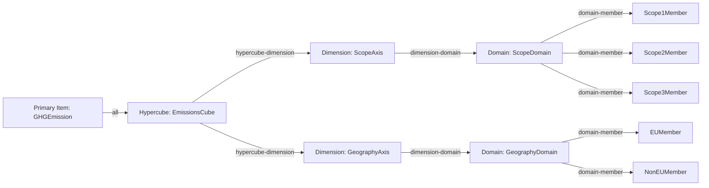

# README Visualisierungen: Taxonomy Explorer lesen

Diese Doku erklaert alle 6 Visualisierungsansichten aus dem Taxonomy Explorer:

1. Tree
2. Graph
3. Layer
4. Matrix
5. Flow
6. Hypercube

Sie dient als Leseanleitung mit Beispielen, damit du schneller von der Ansicht zur fachlichen Aussage kommst.

## Wo finde ich die Dateien?

Nach einem Pipeline-Lauf liegen die Artefakte in output/:

- taxonomy-visualization.html (Startseite)
- taxonomy-visualization-tree.html
- taxonomy-visualization-graph.html
- taxonomy-visualization-layer.html
- taxonomy-visualization-matrix.html
- taxonomy-visualization-flow.html
- taxonomy-visualization-hypercube.html

## Lesestrategie (allgemein)

Wenn du eine Ansicht oeffnest, gehe immer in dieser Reihenfolge vor:

1. Scope klaeren: Welche Konzepte/Layer/Dimensionen sind ueberhaupt im Sample enthalten?
2. Struktur lesen: Welche Beziehungen bestehen (parent-child, referenziert, dimensioniert)?
3. Aussage ableiten: Was bedeutet das fachlich fuer Disclosure, Kontext und Vollstaendigkeit?

---

## 1) Tree View lesen

Was die Ansicht zeigt:

- Presentation-Hierarchie (Parent-Child) der Taxonomie.
- Drilldown in Unterknoten.

Wie man sie liest:

1. Mit Root-Knoten beginnen (oberste Berichtsstruktur).
2. Pro Ebene auf semantische Gruppierung achten (z. B. Topic -> Subtopic -> Kennzahl).
3. Leaf-Knoten als konkrete reportbare Positionen interpretieren.

Beispiel:

- Wenn ein Knoten zu Emissionen mehrere Unterknoten fuer Scope 1/2/3 zeigt, ist die fachliche Struktur in der Taxonomie bereits getrennt angelegt.
- Fehlt ein erwarteter Unterknoten im Sample, kann das an Filterung/Sample-Grenzen liegen, nicht zwingend an einem Modellfehler.

---

## 2) Graph View lesen

Was die Ansicht zeigt:

- Interaktiver Abhaengigkeitsgraph aus Linkbase-Kanten.
- Knotenbeziehungen quer zur Baumstruktur.

Wie man sie liest:

1. Startknoten waehlen (z. B. gesuchtes Konzept).
2. Direkte Nachbarn lesen (ein- und ausgehende Kanten).
3. Layer ein-/ausblenden, um nur relevante Kanten zu sehen.
4. Ueber Suche einen Knoten fokussieren und automatisch zentrieren.

Zusatzfunktionen:

- Themenbasierte Knotengruppierung aus Mapping-Domaenen.
- Distinkte Gruppenfarben.
- Adaptive Label-Dichte je Zoomstufe.
- Klick auf Knoten zeigt Thema, Layer, Grad und Nachbarn.

Beispiel:

- Ein Konzept mit hoher Knotengrad-Zahl ist oft ein Drehscheibenbegriff (stark vernetzt) und sollte bei Mapping-Aenderungen besonders vorsichtig behandelt werden.

---

## 3) Layer View lesen

Was die Ansicht zeigt:

- Linkbase-Layer (Dateien/Kanten) als technische Schichten.
- Aufklappbare Unterelemente pro Layer.

Wie man sie liest:

1. Erst Layer-Namen pruefen (welche Quelle/Datei repraesentiert ist).
2. Unterelemente nur fuer den aktuell interessierenden Layer aufklappen.
3. Bei unerwarteten Beziehungen zuerst den Layer-Kontext validieren.

Beispiel:

- Wenn eine Kante fachlich unplausibel wirkt, hilft der Layer-Blick oft sofort: Die Beziehung stammt dann haeufig aus einer anderen Linkbase-Datei als erwartet.

---

## 4) Matrix View lesen

Was die Ansicht zeigt:

- Analytische Matrix aus Konzeptindex und Layout-/Mapping-Zuordnung.

Wie man sie liest:

1. Konzeptzeile identifizieren.
2. Zuordnung zu Layout-Elementen und Mapping-Feldern pruefen.
3. Luecken (ohne Zuordnung) und Mehrfachzuordnungen markieren.

Beispiel:

- Ein Konzept ohne Layout-Zuordnung ist in der Regel ein Integrationshinweis: Taxonomiebegriff existiert, wird aber im Report-Template noch nicht ausgespielt.

---

## 5) Flow View lesen

Was die Ansicht zeigt:

- Prozesssicht des Reporting-Flows von Datensammlung bis Disclosure.

Wie man sie liest:

1. Von links nach rechts lesen (Input -> Verarbeitung -> Output).
2. Uebergaenge mit hoher Verdichtung markieren (Bottlenecks).
3. Pruefen, wo Validierung/Transformation stattfindet.

Beispiel:

- Wenn viele Inputs auf einen einzelnen Transformationsschritt laufen, ist das ein kritischer Punkt fuer Datenqualitaet und Fehlerdiagnose.

---

## 6) Hypercube View lesen und verstehen

Was die Ansicht zeigt:

- Fuer welche Primary Items eine dimensionale Struktur gilt.
- Aus welchen Achsen, Domains und Members diese Struktur besteht.
- Ob Beziehungen als all oder notAll gebunden sind.

Lesereihenfolge (empfohlen):

1. Hypercube-Kopf lesen: Name und Anzahl gebundener Dimensionen.
2. PRIMARY (ALL) und PRIMARY (NOTALL) pruefen.
3. Pro Dimension Facet-Karte lesen: Domains, Default Member, Domain-Members.
4. Bei vielen Members zuerst Domain- und Default-Logik verstehen, dann Details.

Semantik:

- all: Das Primary Item wird in diesem Hypercube-Kontext erwartet.
- notAll: Ausschluss-/Negativbindung fuer spezielle Kontexte.

### Mermaid-Beispiel: Hypercube-Struktur

Das folgende Diagramm entspricht dem bereits erstellten Beispiel und zeigt die Leselogik von Primary Item ueber Hypercube zu Dimensionen, Domains und Members.

Wie man dieses Beispiel liest:

1. GHGEmission ist ueber all an EmissionsCube gebunden.
2. Der Hypercube hat zwei Achsen: ScopeAxis und GeographyAxis.
3. ScopeAxis verweist auf ScopeDomain mit den Members Scope1/2/3.
4. GeographyAxis verweist auf GeographyDomain mit EUMember und NonEUMember.
5. Eine fachliche Aussage entsteht erst aus der Kombination beider Achsen, z. B. Scope2 in EU.

Beispiel 1: Country-Achse mit leerer Country-Domain

- Hypercube: esrs_AdequateWagesByCountryTable
- Dimension: esrs_CountryAxis
- Beobachtung: Domain country_CountryDomain hat 0 Member im Sample.
- Interpretation: Achse vorhanden, aber in der gerenderten Teilmenge ohne referenzierte Country-Members.

Beispiel 2: Employee-/NonEmployee-Achse mit aktivem Default

- Hypercube: esrs_AdequateWagesByCountryTable
- Dimension: esrs_EmployeesAndNonemployeesAxis
- Default Member: esrs_EmployeesAndNonemployeesNAMember
- Domain-Members (Sample): z. B. esrs_EmployeesMember, esrs_NonemployeesMember
- Interpretation: Ohne expliziten Member greift Default; fuer differenzierte Angaben muss ein expliziter Member gesetzt werden.

---

## Typische Fehlinterpretationen (Kurzcheck)

1. Leere Domain bedeutet nicht automatisch Modellfehler, oft nur Sample-Grenze.
2. Viele Kanten im Graph bedeuten nicht automatisch fachliche Wichtigkeit; erst Layer-Kontext pruefen.
3. Matrix-Luecke ist kein Runtime-Fehler, sondern meist ein Integrations-/Template-Hinweis.
4. Hypercube-Achsen nie isoliert lesen; fachliche Aussage entsteht aus Achsenkombination.

## Wann welche Ansicht?

- Tree: Wenn du fachliche Hierarchie und Platzierung verstehen willst.
- Graph: Wenn du Abhaengigkeiten und Nachbarschaften analysieren willst.
- Layer: Wenn du technische Herkunft einer Beziehung pruefen willst.
- Matrix: Wenn du Mapping- und Layout-Abdeckung bewerten willst.
- Flow: Wenn du Prozess- und Uebergabepunkte analysieren willst.
- Hypercube: Wenn du Dimensionen, Domains, Members und Kontexte verstehen willst.
