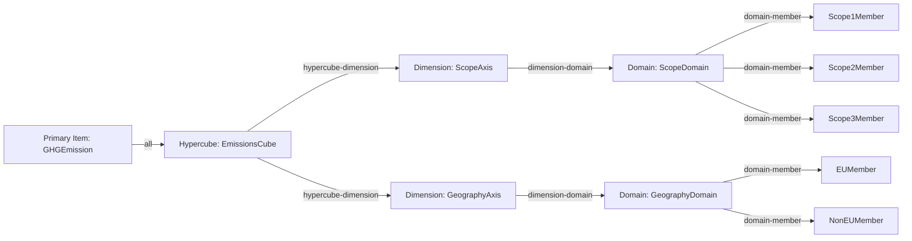

# README Visualisierungen: Taxonomy Explorer lesen

Diese Doku erklaert alle 19 Visualisierungsansichten aus dem Taxonomy Explorer:

1. Tree
2. Graph
3. Layer
4. Matrix
5. Flow
6. Hypercube
7. Hypercube 3D
8. Coverage
9. Enumeration
10. Reference
11. Calculation
12. Intersection
13. Validation
14. Allocation
15. Stats
16. Complexity
17. Impact Heatmap
18. Hypercube Dimension Inventar
19. Mapping Flow

Sie dient als Leseanleitung mit Beispielen, damit du schneller von der Ansicht zur fachlichen Aussage kommst.

## Wo finde ich die Dateien?

Nach einem Pipeline-Lauf liegen die Artefakte in output/:

- taxonomy-visualization.html (Startseite)
- taxonomy-visualization-tree.html
- taxonomy-visualization-graph.html
- taxonomy-visualization-layer.html
- taxonomy-visualization-matrix.html
- taxonomy-visualization-flow.html
- taxonomy-visualization-hypercube.html
- taxonomy-visualization-hypercube-3d.html
- taxonomy-visualization-coverage.html
- taxonomy-visualization-enumeration.html
- taxonomy-visualization-reference.html
- taxonomy-visualization-calculation.html
- taxonomy-visualization-intersection.html
- taxonomy-visualization-validation.html
- taxonomy-visualization-allocation.html
- taxonomy-visualization-stats.html
- taxonomy-visualization-complexity.html
- taxonomy-visualization-impact-heatmap.html
- taxonomy-visualization-hypercube-dimension-inventory.html
- taxonomy-visualization-mapping-flow.html

## Lesestrategie (allgemein)

Wenn du eine Ansicht oeffnest, gehe immer in dieser Reihenfolge vor:

1. Scope klaeren: Welche Konzepte/Layer/Dimensionen sind ueberhaupt im Sample enthalten?
2. Struktur lesen: Welche Beziehungen bestehen (parent-child, referenziert, dimensioniert)?
3. Aussage ableiten: Was bedeutet das fachlich fuer Disclosure, Kontext und Vollstaendigkeit?

---

## 1) Tree View lesen

Was die Ansicht zeigt:

- Presentation-Hierarchie (Parent-Child) der Taxonomie.
- Drilldown in Unterknoten.

Wie man sie liest:

1. Mit Root-Knoten beginnen (oberste Berichtsstruktur).
2. Pro Ebene auf semantische Gruppierung achten (z. B. Topic -> Subtopic -> Kennzahl).
3. Leaf-Knoten als konkrete reportbare Positionen interpretieren.

Beispiel:

- Wenn ein Knoten zu Emissionen mehrere Unterknoten fuer Scope 1/2/3 zeigt, ist die fachliche Struktur in der Taxonomie bereits getrennt angelegt.
- Fehlt ein erwarteter Unterknoten im Sample, kann das an Filterung/Sample-Grenzen liegen, nicht zwingend an einem Modellfehler.

---

## 2) Graph View lesen

Was die Ansicht zeigt:

- Interaktiver Abhaengigkeitsgraph aus Linkbase-Kanten.
- Knotenbeziehungen quer zur Baumstruktur.

Wie man sie liest:

1. Startknoten waehlen (z. B. gesuchtes Konzept).
2. Direkte Nachbarn lesen (ein- und ausgehende Kanten).
3. Layer ein-/ausblenden, um nur relevante Kanten zu sehen.
4. Ueber Suche einen Knoten fokussieren und automatisch zentrieren.

Zusatzfunktionen:

- Themenbasierte Knotengruppierung aus Mapping-Domaenen.
- Distinkte Gruppenfarben.
- Adaptive Label-Dichte je Zoomstufe.
- Klick auf Knoten zeigt Thema, Layer, Grad und Nachbarn.

Beispiel:

- Ein Konzept mit hoher Knotengrad-Zahl ist oft ein Drehscheibenbegriff (stark vernetzt) und sollte bei Mapping-Aenderungen besonders vorsichtig behandelt werden.

---

## 3) Layer View lesen

Was die Ansicht zeigt:

- Linkbase-Layer (Dateien/Kanten) als technische Schichten.
- Aufklappbare Unterelemente pro Layer.

Wie man sie liest:

1. Erst Layer-Namen pruefen (welche Quelle/Datei repraesentiert ist).
2. Unterelemente nur fuer den aktuell interessierenden Layer aufklappen.
3. Bei unerwarteten Beziehungen zuerst den Layer-Kontext validieren.

Beispiel:

- Wenn eine Kante fachlich unplausibel wirkt, hilft der Layer-Blick oft sofort: Die Beziehung stammt dann haeufig aus einer anderen Linkbase-Datei als erwartet.

---

## 4) Matrix View lesen

Was die Ansicht zeigt:

- Analytische Matrix aus Konzeptindex und Layout-/Mapping-Zuordnung.

Wie man sie liest:

1. Konzeptzeile identifizieren.
2. Zuordnung zu Layout-Elementen und Mapping-Feldern pruefen.
3. Luecken (ohne Zuordnung) und Mehrfachzuordnungen markieren.

Beispiel:

- Ein Konzept ohne Layout-Zuordnung ist in der Regel ein Integrationshinweis: Taxonomiebegriff existiert, wird aber im Report-Template noch nicht ausgespielt.

---

## 5) Flow View lesen

Was die Ansicht zeigt:

- Prozesssicht des Reporting-Flows von Datensammlung bis Disclosure.

Wie man sie liest:

1. Von links nach rechts lesen (Input -> Verarbeitung -> Output).
2. Uebergaenge mit hoher Verdichtung markieren (Bottlenecks).
3. Pruefen, wo Validierung/Transformation stattfindet.

Beispiel:

- Wenn viele Inputs auf einen einzelnen Transformationsschritt laufen, ist das ein kritischer Punkt fuer Datenqualitaet und Fehlerdiagnose.

---

## 6) Hypercube View lesen und verstehen

Was die Ansicht zeigt:

- Fuer welche Primary Items eine dimensionale Struktur gilt.
- Aus welchen Achsen, Domains und Members diese Struktur besteht.
- Ob Beziehungen als all oder notAll gebunden sind.

Lesereihenfolge (empfohlen):

1. Hypercube-Kopf lesen: Name und Anzahl gebundener Dimensionen.
2. PRIMARY (ALL) und PRIMARY (NOTALL) pruefen.
3. Pro Dimension Facet-Karte lesen: Domains, Default Member, Domain-Members.
4. Bei vielen Members zuerst Domain- und Default-Logik verstehen, dann Details.

Semantik:

- all: Das Primary Item wird in diesem Hypercube-Kontext erwartet.
- notAll: Ausschluss-/Negativbindung fuer spezielle Kontexte.

### Mermaid-Beispiel: Hypercube-Struktur

Das folgende Diagramm entspricht dem bereits erstellten Beispiel und zeigt die Leselogik von Primary Item ueber Hypercube zu Dimensionen, Domains und Members.

Wie man dieses Beispiel liest:

1. GHGEmission ist ueber all an EmissionsCube gebunden.
2. Der Hypercube hat zwei Achsen: ScopeAxis und GeographyAxis.
3. ScopeAxis verweist auf ScopeDomain mit den Members Scope1/2/3.
4. GeographyAxis verweist auf GeographyDomain mit EUMember und NonEUMember.
5. Eine fachliche Aussage entsteht erst aus der Kombination beider Achsen, z. B. Scope2 in EU.

Beispiel 1: Country-Achse mit leerer Country-Domain

- Hypercube: esrs_AdequateWagesByCountryTable
- Dimension: esrs_CountryAxis
- Beobachtung: Domain country_CountryDomain hat 0 Member im Sample.
- Interpretation: Achse vorhanden, aber in der gerenderten Teilmenge ohne referenzierte Country-Members.

Beispiel 2: Employee-/NonEmployee-Achse mit aktivem Default

- Hypercube: esrs_AdequateWagesByCountryTable
- Dimension: esrs_EmployeesAndNonemployeesAxis
- Default Member: esrs_EmployeesAndNonemployeesNAMember
- Domain-Members (Sample): z. B. esrs_EmployeesMember, esrs_NonemployeesMember
- Interpretation: Ohne expliziten Member greift Default; fuer differenzierte Angaben muss ein expliziter Member gesetzt werden.

---

## Typische Fehlinterpretationen (Kurzcheck)

1. Leere Domain bedeutet nicht automatisch Modellfehler, oft nur Sample-Grenze.
2. Viele Kanten im Graph bedeuten nicht automatisch fachliche Wichtigkeit; erst Layer-Kontext pruefen.
3. Matrix-Luecke ist kein Runtime-Fehler, sondern meist ein Integrations-/Template-Hinweis.
4. Hypercube-Achsen nie isoliert lesen; fachliche Aussage entsteht aus Achsenkombination.

## Wann welche Ansicht?

- Tree: Wenn du fachliche Hierarchie und Platzierung verstehen willst.
- Graph: Wenn du Abhaengigkeiten und Nachbarschaften analysieren willst.
- Layer: Wenn du technische Herkunft einer Beziehung pruefen willst.
- Matrix: Wenn du Mapping- und Layout-Abdeckung bewerten willst.
- Flow: Wenn du Prozess- und Uebergabepunkte analysieren willst.
- Hypercube: Wenn du Dimensionen, Domains, Members und Kontexte verstehen willst.
- Hypercube 3D: Wenn du Hypercubes und Dimensionen raeumlich erkunden und interaktiv zoomen willst.
- Coverage: Wenn du Vollstaendigkeit und Luecken im Mapping/Layout schnell sehen willst.
- Enumeration: Wenn du erlaubte Werte, Domains und enum2-Hinweise pro Konzept pruefen willst.
- Reference: Wenn du Normnachweise je Konzept (ESRS/Regulation) nachvollziehen willst.
- Calculation: Wenn du Auswirkungen auf Rollups/Formeln bei Konzeptaenderungen abschaetzen willst.
- Intersection: Wenn du sinnvolle Dimensionskombinationen je Hypercube abschaetzen willst.
- Validation: Wenn du Regeldateien und ihre Konzeptabhaengigkeiten gezielt analysieren willst.
- Allocation: Wenn du Template-Zuordnung und Mapping-Abdeckung je Section analysieren willst.
- Stats: Wenn du die strukturelle Verteilung von Kanten und Knotenhubs pruefen willst.
- Complexity: Wenn du Testpriorisierung nach technischem/fachlichem Risiko steuern willst.

---

## 7) Hypercube 3D View lesen

Was die Ansicht zeigt:

- Interaktive 3D-Szene aus Hypercube-Kernen und Dimension-Punkten.
- Dimensionen werden je Hypercube als umliegende Knoten mit Domain-/Member-Gewichtung dargestellt.

Wie man sie liest:

1. Zuerst Hypercube anklicken und in der Info-Box Dimensionen, Domains und Members vergleichen.
2. Dann einzelne Dimensionsknoten anklicken, um Details zu Domains/Defaults zu sehen.
3. Mit Suche auf Hypercube oder Dimensionsnamen filtern, dann Kamera auf Auswahl fokussieren.

Beispiel:

- Ein Hypercube mit vielen Dimensionsknoten und hoher Member-Zahl ist meist modellseitig komplexer und sollte bei Release-Tests priorisiert geprueft werden.

## 8) Coverage View lesen

Was die Ansicht zeigt:

- Abdeckung je Konzept ueber vier Achsen: Mapping, Layout, Enumeration, Dimensionen.

Wie man sie liest:

1. Zuerst Summary-Karten betrachten (gesamt vs. ohne Layout).
2. Dann in der Tabelle auf Konzepte mit Layout = nein fokussieren.
3. Bei kritischen Konzepten Felder/Placeholders gegenpruefen.

Beispiel:

- Ein Konzept mit Mapping = ja, Layout = nein ist fachlich vorbereitet, aber im Berichtstemplate noch nicht sichtbar.

## 9) Enumeration View lesen

Was die Ansicht zeigt:

- Enumeration-relevante Konzepte mit Mapping-Domain, Allowed Values und Taxonomie-Hinweisen (enum2:item/set, domain, linkrole).

Wie man sie liest:

1. Nach Konzept oder Domain suchen.
2. Mapping-Domain mit Taxonomie-Domain vergleichen.
3. Allowed Values als Eingabekontrakt fuer Datenquelle/Validierung nutzen.

Beispiel:

- Wenn Mapping-Domain gesetzt ist, aber keine Allowed Values gepflegt sind, sollte die Feldvalidierung ergaenzt werden.

## 10) Reference View lesen

Was die Ansicht zeigt:

- Konzept-zu-Referenz-Nachweise aus output/arelle-concept-reference.csv.
- Verknuepfung zu Mapping-Feldern und Placeholders (falls vorhanden).

Wie man sie liest:

1. Konzept oder ESRS-Referenz im Suchfeld eingeben.
2. Referenzliste pro Konzept pruefen (z. B. ESRS E1-6, S1-1 AR 12).
3. Bei gemappten Konzepten Feld/Placeholder als Implementierungsanker nutzen.

Beispiel:

- Wenn ein Konzept mehrere Referenzen traegt, ist es fachlich in mehreren Offenlegungskontexten relevant und sollte bei Scope-Aenderungen priorisiert getestet werden.

## 11) Calculation View lesen

Was die Ansicht zeigt:

- Sample der Calculation-Kanten (Konzept -> Konzept).
- Formula-Mentions je Konzept aus den Formula-XML-Dateien.
- Impact-Tabelle mit Calc-Degree und Formula-Mentions.

Wie man sie liest:

1. In der Impact-Tabelle Konzepte mit hohem Calc-Degree identifizieren.
2. Danach Formula-Mentions pruefen, um Validierungsfolgen abzuschaetzen.
3. Bei gemappten Feldern gezielt Regressionstests fuer diese Felder ausfuehren.

Beispiel:

- Ein Konzept mit hoher Degree-Zahl und vielen Formula-Mentions ist ein Hotspot. Aenderungen dort koennen sowohl Aggregationen als auch Formellogik beeinflussen.

## 12) Intersection View lesen

Was die Ansicht zeigt:

- Paarweise Dimension-Kombinationen je Hypercube.
- Member-Anzahlen pro Dimension und daraus abgeleitete A x B Kombinationen.

Wie man sie liest:

1. Nach Hypercube filtern und die wichtigsten Dimensionspaare identifizieren.
2. Auf hohe A x B Werte achten: diese Kontexte sind fachlich und technisch komplexer.
3. Kombinationen fuer Testfall-Design und Priorisierung der Validierung nutzen.

Beispiel:

- Wenn ein Hypercube bei ScopeAxis x GeographyAxis eine hohe Kombinationszahl zeigt, sollte fuer jede relevante Region/Scope-Kombination mindestens ein Plausibilitaetstest vorgesehen werden.

## 13) Validation View lesen

Was die Ansicht zeigt:

- Formula-Dateien und die darin gefundenen ESRS-Konzeptverwendungen.
- Konzept-Hotspots nach Mention-Haeufigkeit.

Wie man sie liest:

1. In "Formula-Datei -> Konzepte" die wichtigsten Regeldateien identifizieren.
2. In "Konzept-Hotspots" auf hohe Mention-Zahlen achten.
3. Bei Aenderungen an diesen Konzepten gezielt Validierungs-Regressionstests planen.

Beispiel:

- Wenn ein Konzept in vielen Formula-Dateien auftaucht, ist es ein starker Validierungs-Hotspot. Aenderungen sollten mit erweiterten Tests gegen mehrere Disclosure-Kontexte abgesichert werden.

## 14) Allocation View lesen

Was die Ansicht zeigt:

- Zuordnung von Section -> Placeholder -> Feld -> Konzept.
- Section-Summary mit Anzahl der Placeholders je Bereich.

Wie man sie liest:

1. Ueber Section-Summary schnell Schwerpunkte erkennen.
2. In der Detailtabelle nach fehlendem Konzeptbezug suchen.
3. Placeholder ohne sinnvolle Feldzuordnung priorisiert bereinigen.

Beispiel:

- Wenn eine Section viele Placeholders hat, aber mehrere Zeilen ohne Konzept zeigt, ist die Template-Integration dort unvollstaendig und sollte vor dem naechsten Reporting-Lauf nachgezogen werden.

## 15) Stats View lesen

Was die Ansicht zeigt:

- Layer-Verteilung (Dateien, Kanten, Anteil je Layer).
- Top-Knoten nach Grad (in/out/gesamt) aus dem Edge-Sample.
- Source-only und Target-only Knoten als Strukturhinweis.

Wie man sie liest:

1. Kantenanteile je Layer gegen Erwartung pruefen (z. B. Definition/Presentation-Balance).
2. Top-Knoten mit hohem Grad als zentrale Hubs betrachten.
3. Source-only/Target-only als Hinweise fuer Randbereiche interpretieren (Sample-basiert).

Beispiel:

- Ein sehr hoher Degree bei wenigen Knoten weist auf zentrale Drehscheiben hin. Mapping-Aenderungen an diesen Konzepten sollten priorisiert mit End-to-End-Tests abgesichert werden.

## 16) Complexity View lesen

Was die Ansicht zeigt:

- Risiko-Score pro Konzept aus vier Signalen:
    - Dimensionsanzahl,
    - Enumeration-Signale,
    - Calculation-Grad,
    - Formula-Mentions.

Wie man sie liest:

1. Konzepte mit hohem Score als erste Kandidaten fuer Regressionstests waehlen.
2. Score-Bestandteile vergleichen, um den Treiber zu verstehen (z. B. viele Dimensionen vs. viele Formeln).
3. Bei Mapping-Aenderungen zuerst High-Risk-Konzepte absichern.

Beispiel:

- Hat ein Konzept Score >= 20 und gleichzeitig hohen Calculation-Grad, sollte es vor Release mindestens durch Unit-, Integrations- und Strict-Gate-Lauf verifiziert werden.
