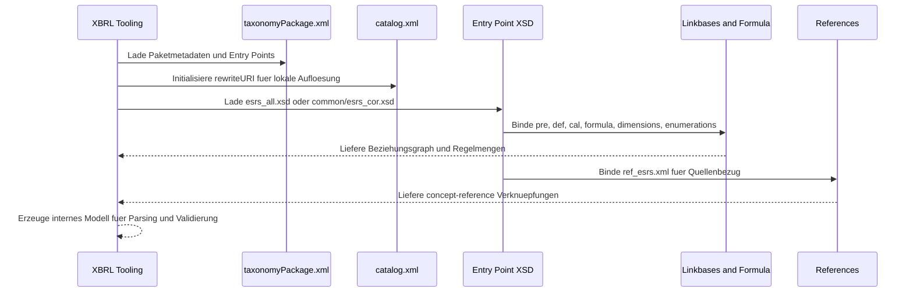
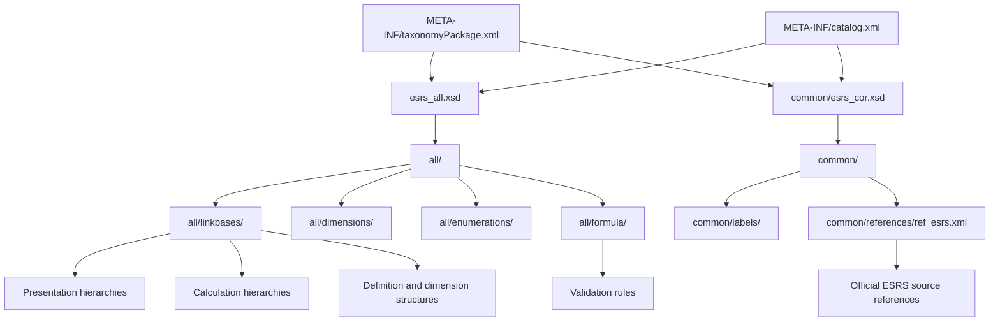

# Technische Grundlagen der ESRS-XBRL-Taxonomie

Stand: 2026-08-14

Aktualisiert auf den aktuellen Projektstand mit den jüngsten Änderungen an Visualisierungen, Import- und Analysekomponenten. Die fachliche Taxonomie und die technische Struktur bleiben unverändert, die Dokumentation wurde aber auf den aktuellen Repository-Zustand abgeglichen.

Diese Datei erklärt die technische Architektur dieses Projekts so, dass nicht nur die Ordnerstruktur sichtbar ist, sondern auch das zugrundeliegende Modell aus XML, XSD, Namespaces, XBRL-Linkbases, Referenzen, Dimensionslogik und Offline-Auflösung verstanden wird.

## Kurzüberblick

Dieses Repository ist kein klassisches Anwendungsprojekt, sondern ein XBRL-Taxonomiepaket für die ESRS Set 1. Der fachliche Kern liegt im versionierten Verzeichnis `xbrl.efrag.org/taxonomy/esrs/2023-12-22/`; `META-INF/` beschreibt das Paket als Ganzes und macht die Taxonomie über Entry Points und Katalogregeln nutzbar.

Technisch besteht die Lösung aus:

- einem Taxonomy Package mit Metadaten, Publisher-Angaben und Entry Points,
- einem XML-Katalog für lokale URI-Auflösung,
- zwei XSD-Entry-Points für unterschiedliche Nutzungsszenarien,
- einer großen Menge von Linkbases für Präsentation, Berechnung, Definition, Formeln, Labels und References,
- Dimensions- und Enumerationsmodellen für kontrollierte Werte und Achsen,
- fachlichen Referenzen auf die offizielle EFRAG-ESRS-Quelle.

## Was ist XBRL und was ist daran besonders?

XBRL (eXtensible Business Reporting Language) ist ein Standard für digitale Unternehmens- und Regulatorikberichterstattung. XBRL ist nicht nur ein Dateiformat, sondern ein Modell aus:

- fachlichen Konzepten (Taxonomie),
- strukturierten Fakten (Instanzdaten),
- Kontextinformationen (Zeitraum, Einheit, Entity, Dimensionen),
- und regelbasierten Beziehungen (Linkbases und Formeln).

Die Besonderheit von XBRL ist, dass nicht nur Werte übertragen werden, sondern deren fachliche Bedeutung, Struktur, Beziehungen und Prüfbarkeit maschinenlesbar mitgeliefert werden.

### XBRL-Bausteine im Kern

1. **Konzepte statt Spaltennamen**
    Ein Datenpunkt ist ein standardisiertes Konzept in der Taxonomie, nicht ein frei benanntes Feld.

2. **Kontext ist Teil des Fakts**
    Ein Wert ist erst vollständig mit Kontext: für welche Periode, welche Berichtseinheit, welche Dimension/Ausprägung.

3. **Einheiten sind explizit**
    Numerische Fakten tragen Einheiten (z. B. Währungen, Mengen, Emissionseinheiten) und sind damit konsistent prüfbar.

4. **Beziehungsmodell statt flacher Tabelle**
    Konzepte sind über Presentation-, Calculation- und Definition-Linkbases verbunden.

5. **Validierungsfähigkeit**
    Über Formula- und Strukturregeln können Berichte automatisiert auf Vollständigkeit und Konsistenz geprüft werden.

6. **Mehrsprachigkeitsfähigkeit**
    Anzeigenamen und Dokumentationen sind über Label-Resources mit `xml:lang` sprachfähig modellierbar.

### Besonderheiten im ESRS-Projekt

Dieses Repository nutzt die XBRL-Stärken sehr konsequent:

- **Strikte Trennung von Struktur und Darstellung**: Konzepte in `common/esrs_cor.xsd`, Darstellung in Label-Dateien.
- **Starke Semantik über Linkbases**: sehr viele `pre_`, `def_`, `cal_`-Dateien für Anzeige, Semantik und Rechenbezüge.
- **Dimensionale Modellierung**: Berichtsinhalte werden über zusätzliche Achsen differenziert.
- **Kontrollierte Wertelisten**: Enumerationen unter `all/enumerations/` verhindern freie, uneinheitliche Ausprägungen.
- **Regelbasierte Qualitätssicherung**: Formeln in `all/formula/` unterstützen technische Validierungen.
- **Rückverfolgbarkeit zur Normquelle**: `common/references/ref_esrs.xml` verknüpft Konzepte mit ESRS-Referenzstellen.
- **Offline-fähige Standardnutzung**: `META-INF/catalog.xml` mappt offizielle URIs auf lokale Pfade.
- **Versionierte Stabilität**: der Pfad `.../2023-12-22/` macht die Taxonomie eindeutig versioniert und reproduzierbar.

### Warum XBRL für ESRS besonders geeignet ist

ESRS verlangt viele strukturierte Angaben mit Kontext, Vergleichbarkeit und Prüfbarkeit. Genau dafür ist XBRL gebaut:

- komplexe Hierarchien,
- gemischte Datentypen (Zahl, Textblock, kontrollierte Auswahl),
- dimensionsbezogene Zerlegungen,
- automatisierbare Qualitätsregeln,
- konsistente Weiterverarbeitung in Aufsicht, Analyse und Software.

Ohne XBRL müsste ein großer Teil dieser Semantik implizit in Dokumenttexten oder manuellen Mapping-Tabellen gepflegt werden. Mit XBRL ist sie explizit im technischen Modell verankert.

## Was sind XML und XSD?

### XML

XML steht für Extensible Markup Language. XML-Dateien sind hier die Basisform fast aller Ressourcen im Projekt. XML beschreibt Daten über verschachtelte Elemente und Attribute, aber nicht wie ein Programm ausgeführt wird.

Im Projekt sind XML-Dateien zum Beispiel:

- `META-INF/taxonomyPackage.xml`
- `META-INF/catalog.xml`
- `xbrl.efrag.org/taxonomy/esrs/2023-12-22/common/references/ref_esrs.xml`
- alle Linkbases unter `all/linkbases/`, `all/formula/`, `common/labels/` und `common/references/`

XML ist hier das Austauschformat für Metadaten, fachliche Beziehungen und referenzierte Quellen.

### XSD

XSD steht für XML Schema Definition. Eine XSD-Datei beschreibt die Struktur und die Regeln für XML-Daten. Sie legt fest, welche Elemente und Attribute vorkommen dürfen, in welchem Namespace sie liegen, wie sie benannt sind und welche anderen Dateien eingebunden werden.

Im Projekt sind die wichtigsten XSD-Dateien:

- `xbrl.efrag.org/taxonomy/esrs/2023-12-22/esrs_all.xsd`
- `xbrl.efrag.org/taxonomy/esrs/2023-12-22/common/esrs_cor.xsd`

Die XSD-Dateien sind hier nicht nur „Schemas“ im abstrakten Sinn, sondern die Einstiegspunkte des gesamten Taxonomiegraphen. Über `link:linkbaseRef` binden sie die übrigen Ressourcen ein.

### Template- und Asset-Schicht fuer die Berichtsgenerierung

Fuer die praktische Berichtserzeugung ist zusaetzlich eine versionierte Template-Schicht erforderlich. Diese wird durch die Coding-KI selbst erstellt und gepflegt und muss mindestens folgende Artefakte enthalten:

- `templates/report-base.xhtml`
- `templates/assets/report.css`
- `templates/assets/report.js`
- `mapping/report-layout-map.json`

Die iXBRL-Einbettung und die finale HTML-Sicht muessen auf dieser Template-Basis aufsetzen.

## Was ist ein Namespace?

Ein Namespace ist ein technischer Namensraum. Er verhindert Kollisionen zwischen Elementen, Attributen und Typen, die denselben Namen haben könnten, aber aus unterschiedlichen Vokabularen stammen.

Im Projekt sieht man mehrere unterschiedliche Namespaces gleichzeitig:

- `https://xbrl.efrag.org/taxonomy/esrs/2023-12-22` für das ESRS-Fachvokabular
- `https://xbrl.efrag.org/taxonomy/esrs/2023-12-22/entry` für den Entry-Point-Namespace in `esrs_all.xsd`
- `http://www.w3.org/2001/XMLSchema` für die XSD-Metakonstrukte
- `http://www.xbrl.org/2003/linkbase` für XBRL-Linkbases
- `http://www.w3.org/1999/xlink` für Verknüpfungsattribute wie `xlink:href`, `xlink:role` und `xlink:arcrole`
- `http://xbrl.org/2005/xbrldt` für XBRL Dimensions
- `http://xbrl.org/2020/extensible-enumerations-2.0` für erweiterbare Enumerationen
- `http://www.xbrl.org/2003/instance` für XBRL-Instanzkonzepte
- `https://xbrl.org/2024/iso3166` für standardisierte Ländercodes in der Core-Taxonomie

Namespaces sind in diesem Projekt zentral, weil das Paket sehr viele verschiedene Standardvokabulare gleichzeitig nutzt.

## Technischer Aufbau des Projekts

### 1. Paketbeschreibung in `META-INF/`

`META-INF/taxonomyPackage.xml` beschreibt das Paket als Ganzes. Dort stehen:

- der Paketname,
- die Version,
- die Publisher-Angaben,
- die Veröffentlichung,
- die Lizenzreferenz,
- die Entry Points.

Das Paket ist also der äußere Container. Es sagt nicht, was jedes einzelne ESRS-Konzept bedeutet, sondern wo die Taxonomie beginnt und welche Ressourcen dazugehören.

### 2. Offline-Auflösung über `catalog.xml`

`META-INF/catalog.xml` enthält eine `rewriteURI`-Regel:

- die Online-Basis-URI `https://xbrl.efrag.org/taxonomy/esrs/2023-12-22/`
- wird lokal auf `../xbrl.efrag.org/taxonomy/esrs/2023-12-22/` umgebogen

Das ist technisch wichtig, weil viele XBRL-Dateien relative oder absolute Referenzen auf den offiziellen Online-Namensraum enthalten. Der Katalog macht das Paket offline nutzbar, ohne die Verlinkungen im Inhalt ändern zu müssen.

### 3. Zwei Entry Points mit unterschiedlicher Tiefe

`META-INF/taxonomyPackage.xml` definiert zwei Einstiegspunkte:

- `esrs_all.xsd` für die vollständige Taxonomie
- `common/esrs_cor.xsd` für den Core-Teil mit Konzepten, Labels und References

Das ist ein typisches Architekturprinzip in XBRL-Projekten: ein vollständiger Einstiegspunkt für Validierung und Datenmodellierung, und ein reduzierter Einstiegspunkt für reine Begriffsauswertung oder Basisverarbeitung.

### 4. Versionierter Fachbaum

Die fachlichen Ressourcen liegen unter `xbrl.efrag.org/taxonomy/esrs/2023-12-22/`. Diese Struktur ist versioniert und stabil. Die Versionsnummer im Pfad ist nicht dekorativ, sondern Teil der fachlichen Identität der Taxonomie.

Die Unterverzeichnisse trennen die Ressourcentypen:

- `all/` für den vollständigen fachlichen Ausbau
- `common/` für gemeinsame Ressourcen

## Welche Dateien was leisten

### `esrs_all.xsd`

Die Datei ist der vollständige Einstiegspunkt. Sie referenziert:

- Formula-Linkbases in `all/formula/`
- Presentation-Linkbases in `all/linkbases/`
- Calculation-Linkbases in `all/linkbases/`
- Definition-Linkbases in `all/linkbases/`
- Dimensions und Enumerations im `all/`-Bereich

Technisch bedeutet das: Wer diese XSD lädt, bekommt die komplette fachliche Taxonomie mit allen Beziehungen und Prüfregeln.

### `common/esrs_cor.xsd`

Die Datei ist der reduzierte Core-Einstiegspunkt. Sie bindet unter anderem ein:

- `labels/lab_esrs-en.xml`
- `labels/doc_esrs-en.xml`
- `references/ref_esrs.xml`
- `../all/dimensions/dim_esrs_990000.xml`
- die Enumerations-Definitionen aus `../all/enumerations/`

Zusätzlich enthält sie viele `roleType`-Definitionen für ESRS-Themenblöcke. Diese `roleType`-Einträge sind die logischen Schablonen, mit denen die Linkbases strukturiert werden.

### `common/references/ref_esrs.xml`

Diese Datei ist der wichtigste Referenzanker der Taxonomie. Sie enthält sehr viele `link:reference`-Ressourcen, die über `link:referenceArc` mit Konzepten verbunden werden.

Inhaltlich ist das die Brücke von der technischen Taxonomie zurück zur fachlichen ESRS-Quelle. Die Referenzen zeigen oft auf die offizielle EFRAG-Seite `https://xbrl.efrag.org/e-esrs/esrs-set1-2023.html#...`.

### `all/linkbases/`

Die Linkbases sind die eigentliche Beziehungsarchitektur der Taxonomie. Sie sind nach Rollen, Themen und Strukturarten getrennt:

- `pre_esrs_*.xml` für Präsentationshierarchien
- `cal_esrs_*.xml` für Summations- und Berechnungslogik
- `def_esrs_*.xml` für semantische Definitionen, Domains und Dimensionsbeziehungen

### `all/dimensions/`

Die Dimensionen modellieren zusätzliche Achsen, nach denen ein Sachverhalt spezifiziert werden kann. Beispiele sind Ausprägungen wie Scope, Land, Segment oder andere fachliche Unterteilungen.

### `all/enumerations/`

Die Enumerations-Dateien definieren kontrollierte Wertelisten. Sie sorgen dafür, dass Berichte nicht beliebige Texte liefern, sondern nur fachlich erlaubte Ausprägungen.

### `all/formula/`

Die Formula-Linkbases definieren Validierungsregeln und fachliche Prüfungen, etwa:

- Pflichtfelder,
- zulässige Einheiten,
- typed-dimension-bezogene Regeln,
- inhaltliche Vollständigkeit.

## Mehrsprachigkeit

Mehrsprachigkeit ist in der XBRL-Technik grundsätzlich vorgesehen, und dieses Projekt nutzt diese Möglichkeit technisch mit sprachmarkierten Ressourcen. Praktisch ist das Paket in der vorliegenden Auslieferung aber auf Englisch beschränkt.

Das sieht man an mehreren Stellen:

- [META-INF/taxonomyPackage.xml](META-INF/taxonomyPackage.xml) setzt `xml:lang="en"` auf Paketebene.
- [common/labels/lab_esrs-en.xml](xbrl.efrag.org/taxonomy/esrs/2023-12-22/common/labels/lab_esrs-en.xml) enthält XBRL-Labels mit `xml:lang="en"`.
- [common/labels/doc_esrs-en.xml](xbrl.efrag.org/taxonomy/esrs/2023-12-22/common/labels/doc_esrs-en.xml) enthält die Dokumentationslabels ebenfalls mit `xml:lang="en"`.
- [common/labels/gla_esrs-en.xml](xbrl.efrag.org/taxonomy/esrs/2023-12-22/common/labels/gla_esrs-en.xml) liefert zusätzliche englische Rollenlabels für die allgemeine Gliederung.

### Wie sie technisch umgesetzt ist

Die Implementierung folgt dem XBRL-Standardmodell für sprachabhängige Beschriftungen:

- Ein Konzept kann mehrere Label- oder Dokumentationsressourcen haben.
- Jede Ressource trägt ein `xml:lang`, damit der Konsument die Sprache kennt.
- Die sprachspezifischen Ressourcen liegen in separaten Dateien, hier sichtbar als Dateien mit dem Suffix `-en`.
- Die Labels werden über die Core-XSD [common/esrs_cor.xsd](xbrl.efrag.org/taxonomy/esrs/2023-12-22/common/esrs_cor.xsd) eingebunden.

### Was in diesem Paket nicht sichtbar ist

In den vorliegenden Dateien sind keine parallelen Sprachdateien wie `-de`, `-fr` oder `-it` erkennbar. Auch die Label- und Dokumentationsdateien selbst sind ausschließlich englischsprachig.

Das heißt: Die Taxonomie ist technisch mehrsprachigkeitsfähig, aber die ausgelieferte Instanz dieses Pakets ist faktisch einsprachig.

### Frage zu Mehrsprachigkeit

wenn datenpunkte für einen xbrl bericht auf deutsch vorliegen, insbesondere bei einer aufzählung, ist das dann problematisch? bräuchte man dann nicht erst eine standardisierte übersetzung der englischen taxonomie? müsste diese nicht von der efrag herausgegeben werden oder von wem sonst?

> Kurz: Nein, deutschsprachige Inhalte sind nicht automatisch problematisch. Entscheidend ist, was im XBRL-Fakt steht.
    Bei XBRL sind die Konzeptnamen und Fakten technisch sprachneutral. Ein Berichtsdatensatz verweist auf ein Konzept wie ein Datenpunkt-Label, aber die eigentliche technische Identität ist das Konzept selbst, nicht dessen Anzeige-Text. Deshalb braucht man für einen XBRL-Bericht normalerweise keine deutsche Übersetzung der Taxonomie, nur weil ein Mensch den Bericht auf Deutsch lesen oder eine narrative Angabe auf Deutsch erfassen will.

    Wichtig ist die Unterscheidung:

    Numerische Datenpunkte sind sprachunabhängig.
    Textblöcke / narrative Angaben können je nach Filing-Regeln auch auf Deutsch sein, wenn die jeweilige Vorgabe das zulässt.
    Aufzählungen / Enumerationen sind der kritische Fall: Dort sollte man nicht frei übersetzen, sondern die standardisierten Werte verwenden, die die Taxonomie vorgibt. Wenn eine Liste fachlich als kontrollierte Werteliste modelliert ist, dann ist nicht die deutsche Übersetzung maßgeblich, sondern der definierte Member- oder Code-Wert.
    Eine „deutsche Taxonomie“ wäre daher in der Regel kein Ersatz für die fachliche Originaltaxonomie, sondern eher eine zusätzliche Label- oder Dokumentationsübersetzung. Technisch würde man das über zusätzliche Sprach-Label-Dateien lösen, nicht durch neue Datenpunkte oder andere Konzeptnamen. Die Autorität über solche Übersetzungen liegt normalerweise bei der Taxonomie-Herausgeberin oder einer von ihr beauftragten Stelle, also hier typischerweise EFRAG oder ein von EFRAG / der zuständigen Regulierungsinstanz beauftragter Taxonomie-Publisher. Nationale Aufsichts- oder Filing-Stellen können zusätzlich eigene Sprach- oder Sichtschichten liefern, aber sie ändern nicht die zugrunde liegende Standard-Taxonomie.

    Die praktische Regel ist also: Deutsch ist als Lesesprache oder bei freiem Text oft okay, aber nicht als Ersatz für standardisierte Aufzählungswerte oder technische Konzepte. Wenn eine Position in der Taxonomie eine feste fachliche Liste erwartet, sollte man genau diese Liste verwenden, nicht eine freie deutsche Übersetzung davon.

## Konkrete Projektbeispiele

Die technische Struktur wird besonders sichtbar, wenn man die Kern-Dateien direkt liest.

### Beispiel 1: Taxonomy Package als Eintrittskarte

In `META-INF/taxonomyPackage.xml` steht nicht die Fachlogik selbst, sondern die Beschreibung des Gesamtpakets:

```xml
<tp:taxonomyPackage xmlns:xsi="http://www.w3.org/2001/XMLSchema-instance"
                   xmlns:tp="http://xbrl.org/2016/taxonomy-package"
                   xsi:schemaLocation="http://xbrl.org/2016/taxonomy-package http://www.xbrl.org/2016/taxonomy-package.xsd">
    <tp:entryPoints>
        <tp:entryPoint>
            <tp:name>ESRS All (all topics and disclosure requirements, with all linkbases)</tp:name>
            <tp:entryPointDocument href="https://xbrl.efrag.org/taxonomy/esrs/2023-12-22/esrs_all.xsd"/>
        </tp:entryPoint>
    </tp:entryPoints>
</tp:taxonomyPackage>
```

Das zeigt zwei Dinge: Das Paket ist standardisiert über den Taxonomy-Package-Namespace, und der eigentliche fachliche Einstieg erfolgt über eine XSD-Entry-Point-Datei.

### Beispiel 2: Offline-Auflösung per XML Catalog

`META-INF/catalog.xml` lenkt Online-URIs auf lokale Dateien um:

```xml
<catalog xmlns="urn:oasis:names:tc:entity:xmlns:xml:catalog">
    <rewriteURI uriStartString="https://xbrl.efrag.org/taxonomy/esrs/2023-12-22/"
                rewritePrefix="../xbrl.efrag.org/taxonomy/esrs/2023-12-22/"/>
</catalog>
```

Das ist technisch entscheidend, weil die XSDs und Linkbases oft mit dem offiziellen Online-Pfad referenzieren, der Katalog aber die lokale Arbeitskopie bedient.

### Beispiel 3: Ein XSD-Entry-Point lädt die Taxonomie zusammen

In `xbrl.efrag.org/taxonomy/esrs/2023-12-22/esrs_all.xsd` wird die Taxonomie über `link:linkbaseRef` zusammengebaut:

```xml
<xsd:annotation>
    <xsd:appinfo>
        <link:linkbaseRef xlink:type="simple" xlink:href="all/formula/for_esrs.xml"/>
        <link:linkbaseRef xlink:type="simple" xlink:href="all/linkbases/pre_esrs_200510.xml"/>
        <link:linkbaseRef xlink:type="simple" xlink:href="all/linkbases/def_esrs_200510.xml"/>
    </xsd:appinfo>
</xsd:annotation>
<xsd:import namespace="https://xbrl.efrag.org/taxonomy/esrs/2023-12-22"
            schemaLocation="common/esrs_cor.xsd"/>
```

Hier sieht man die klassische XBRL-Technik: Das Schema importiert den Core-Bereich und bindet parallel die Linkbases für Regeln, Anzeige und semantische Beziehungen ein.

### Beispiel 4: Der Core-Einstiegspunkt definiert Rollen und Basismodell

`common/esrs_cor.xsd` ist die reduzierte, aber sehr wichtige Basisschicht:

```xml
<link:linkbaseRef xlink:type="simple" xlink:href="labels/lab_esrs-en.xml"/>
<link:linkbaseRef xlink:type="simple" xlink:href="references/ref_esrs.xml"/>
<link:roleType roleURI="https://xbrl.efrag.org/taxonomy/role-200510" id="role-200510">
    <link:definition>[200510] ESRS2.BP-1 General basis for preparation of sustainability statement - general</link:definition>
</link:roleType>
```

Das bedeutet: Der Core-Baum definiert nicht nur Labels und Referenzen, sondern auch die fachlichen Lesepfade für ganze ESRS-Abschnitte.

### Beispiel 5: Referenzen als Brücke zur Fachquelle

In `common/references/ref_esrs.xml` werden Konzepte mit der externen ESRS-Quelle verbunden:

```xml
<link:reference xlink:type="resource" xlink:role="http://www.xbrl.org/2003/role/reference">
    <ref:URI>https://xbrl.efrag.org/e-esrs/esrs-set1-2023.html#5273</ref:URI>
</link:reference>
<link:referenceArc xlink:type="arc" xlink:arcrole="http://www.xbrl.org/2003/arcrole/concept-reference"
                   xlink:from="DescriptionOfSpecificScopeOfApplicationOfCarbonPricingSchemeExplanatory"
                   xlink:to="reference_DescriptionOfSpecificScopeOfApplicationOfCarbonPricingSchemeExplanatory"/>
```

Damit wird aus einem abstrakten XBRL-Konzept ein rückverfolgbarer Fachverweis auf die ESRS-Quelle.

## Wie die Verknüpfung technisch funktioniert

### `link:linkbaseRef`

Ein `link:linkbaseRef` in einer XSD bindet eine Linkbase-Datei ein. Das ist die technische Verlinkung zwischen Schema und Beziehungsnetz.

Beispielhaft macht `esrs_all.xsd` damit aus einer Schema-Datei einen vollständigen Einstieg in das gesamte Modell.

### `xlink:href`

`xlink:href` zeigt auf die Zielressource. In diesem Projekt verweist das oft auf relative Dateien innerhalb des Taxonomiebaums.

### `xlink:role`

`xlink:role` gibt an, welche fachliche Rolle eine Ressource oder Linkbase-Zuordnung hat. In XBRL ist das wichtig, um gleiche Dateitypen in unterschiedliche semantische Kontexte einzuordnen.

### `xlink:arcrole`

`xlink:arcrole` beschreibt die Art der Beziehung zwischen zwei Knoten. Ein Arcrole ist also keine Datenquelle, sondern die Beschreibung des Beziehungstyps.

Im Projekt sind besonders relevant:

- `http://www.xbrl.org/2003/arcrole/concept-reference`
- Parent-Child-Relationen in Präsentationslinkbases
- Summationsrelationen in Calculation-Linkbases
- Domain-Member-Relationen in Definition-Linkbases

## Wo die Hierarchien liegen

### 1. Präsentationshierarchien

Die Präsentationslinkbases bestimmen, wie Fachkonzepte in einem Baum angezeigt werden. Sie modellieren Struktur, Reihenfolge und Einrückung.

Das ist die Sicht, die ein Mensch beim Lesen eines Berichts oder einer Taxonomie meist zuerst wahrnimmt.

### 2. Berechnungshierarchien

Die Calculation-Linkbases enthalten Summenbeziehungen. Sie zeigen, welche Konzepte als Teilwerte zu einem Gesamtwert gehören.

Das ist keine bloße Anzeigehierarchie, sondern eine semantische Rechenregel.

### 3. Definitions- und Dimensionshierarchien

Definition-Linkbases modellieren semantische Regeln für Domänen, Members und Dimensionen.

Hier wird festgelegt:

- welche Member zu einer Dimension gehören,
- welche Werte zulässig sind,
- wie Achsen und Ausprägungen zusammenspielen.

### 4. Referenzhierarchien

Reference-Linkbases verknüpfen ein Konzept mit dem fachlichen Ursprungstext. Damit wird die technische Taxonomie rückverfolgbar.

## Rolle von `roleType`

`roleType` ist die logische Beschreibung eines fachlichen Abschnitts. In `common/esrs_cor.xsd` gibt es viele dieser Rollen, etwa für:

- allgemeine ESRS-Basisangaben,
- Governance-Abschnitte,
- Strategie und Geschäftsmodell,
- Stakeholder-Interessen,
- IRO-Prozesse,
- klimabezogene und thematische Unterbereiche.

Technisch ist `roleType` wichtig, weil eine Taxonomie nicht nur „Konzepte“ hat, sondern auch strukturierte Lesepfade. Rollen definieren diese Pfade.

## Warum das Projekt in `all/` und `common/` getrennt ist

Die Trennung ist fachlich und technisch sinnvoll:

- `all/` enthält die vollständige Taxonomie mit allen Themen, Linkbases, Dimensionen und Formeln.
- `common/` enthält die gemeinsame Basisschicht, die auch für kompaktere Workflows ausreicht.

So kann dieselbe Taxonomie in unterschiedlichen Tiefen konsumiert werden. Wer nur Labels, Referenzen und Basisbegriffe braucht, lädt weniger. Wer validieren oder strukturierte Berichte bauen will, lädt den vollständigen Baum.

## Interne und externe Verlinkungen

### Interne Verlinkungen

Interne Verlinkungen verbinden Dateien innerhalb des Repositorys. Dazu gehören zum Beispiel:

- Entry Point zu Linkbases,
- Linkbases zu Dimensions,
- Reference-Linkbases zu ESRS-Konzepten,
- Dimensions zu Enumerations.

### Externe Verlinkungen

Externe Verlinkungen zeigen auf Standards oder auf die offizielle Fachquelle. Typische Beispiele im Projekt sind:

- XML- und XBRL-Standard-Namespaces,
- die Taxonomy-Package-XSD,
- das OASIS-Catalog-DTD,
- die EFRAG-ESRS-Webreferenzen,
- XBRL-Standard-Arcroles und -Roles.

Diese externen Verweise sind nicht Zufall, sondern die Verbindung des lokalen Modells mit internationalen Standards und der rechtlich/fachlichen Quelle.

## Was die Projektstruktur fachlich ausdrückt

Die Verzeichnisstruktur ist selbst schon ein Modell:

- `META-INF/` sagt: Das ist ein paketiertes, standardisiertes Taxonomieobjekt.
- `xbrl.efrag.org/taxonomy/esrs/2023-12-22/` sagt: Die Fachlogik ist versioniert und unter einem stabilen URI-Schema organisiert.
- `all/` sagt: Hier liegt die vollständige Arbeits- und Validierungssicht.
- `common/` sagt: Hier liegt das gemeinsame Vokabular für Wiederverwendung und reduzierte Verarbeitung.
- `linkbases/`, `dimensions/`, `enumerations/`, `formula/` sagen: Die Taxonomie trennt Anzeige, Semantik, Werte, Regeln und Prüfungen.

## Praktische Lesereihenfolge

Wenn du das Projekt technisch verstehen willst, ist diese Reihenfolge am sinnvollsten:

1. `META-INF/taxonomyPackage.xml`
2. `META-INF/catalog.xml`
3. `xbrl.efrag.org/taxonomy/esrs/2023-12-22/esrs_all.xsd`
4. `xbrl.efrag.org/taxonomy/esrs/2023-12-22/common/esrs_cor.xsd`
5. `xbrl.efrag.org/taxonomy/esrs/2023-12-22/common/references/ref_esrs.xml`
6. die Linkbases unter `all/linkbases/`
7. die Formeln unter `all/formula/`
8. die Dimensions- und Enumerationsdateien unter `all/dimensions/` und `all/enumerations/`

## Warum dieses Projekt technisch gut aufgesetzt ist

Die Architektur folgt klaren Standards:

- XML als universelles Austauschformat,
- XSD für strukturierte Einstiegspunkte,
- XML Catalog für offlinefähige Ressourcenauflösung,
- XBRL Linkbases für semantische Beziehungen,
- Namespace-Trennung für Standard- und Fachvokabular,
- versionierter Pfad für reproduzierbare Referenzen,
- Trennung von Kern- und Vollausbau für unterschiedliche Nutzungstiefen.

Das Ergebnis ist kein „flaches Dateiset“, sondern ein graphartig aufgebautes Fachmodell mit expliziten Kanten zwischen Konzepten, Rollen, Regeln und Quellen.

## Technische Grenzen und Nicht-Ziele der Taxonomie

Wichtig für die Einordnung: Dieses Repository ist die **Taxonomie**, nicht der eigentliche Berichtsdatensatz.

- Es enthält die Modellregeln, aber keine unternehmensspezifischen ESRS-Meldedaten.
- Es definiert zulässige Konzepte, Kontexte und Beziehungen, aber keine bereits befüllten Fakten.
- Es liefert Referenzierbarkeit und Validierbarkeit, aber keine fachliche Materialitätsentscheidung eines konkreten Unternehmens.
- Es ist ein versionierter Standardstand (`2023-12-22`), nicht automatisch ein Änderungsprotokoll über Folgeversionen.

## Verarbeitungs- und Validierungspipeline

In der Praxis ist eine deterministische Reihenfolge sinnvoll, damit Parser und Validatoren konsistente Ergebnisse liefern.

<!-- markdownlint-disable-next-line MD046 -->


## Typische Fehlerbilder bei Implementierungen

Diese Fehler treten in XBRL-Implementierungen besonders oft auf:

1. **Catalog wird ignoriert**: Online-URIs werden direkt aufgelöst und lokale Verarbeitung bricht offline.
2. **Linkbase-Typen werden vermischt**: Presentation-Beziehungen werden wie Calculation- oder Definition-Logik behandelt.
3. **Enumerationen als Freitext**: Kontrollierte Wertelisten werden nicht als constraints geprüft.
4. **Dimensionskontext unvollständig**: Fakten werden ohne vollständigen Kontext (insbesondere Axis/Member) interpretiert.
5. **Referenzen werden verworfen**: Rückverfolgbarkeit zur ESRS-Quelle fehlt in nachgelagerten Systemen.
6. **Version wird nicht fixiert**: Ergebnisse aus unterschiedlichen Taxonomieversionen werden unbewusst vermischt.

## Mindest-Checkliste für robuste Verarbeitung

1. Entry-Point-Auswahl dokumentieren (`esrs_all.xsd` oder `common/esrs_cor.xsd`).
2. URI-Rewrite aus `META-INF/catalog.xml` aktiv testen.
3. Für jedes Konzept die Rollen- und Arcrole-Kontexte mitführen.
4. Enumerations und typed dimensions als harte Validierungsregeln behandeln.
5. Reference-Arcs in ein Mapping `Konzept -> ESRS-Quelle` übernehmen.
6. Taxonomieversion in jedem Verarbeitungslauf als Pflichtmetadatum speichern.

## Mermaid-Übersicht

<!-- markdownlint-disable-next-line MD046 -->


## Merksatz

Dieses Projekt ist technisch eine standardisierte, versionierte und offlinefähige XBRL-Taxonomie. Die XSD-Dateien sind die Einstiegstore, die Linkbases sind die Beziehungsmasse, die Namespaces verhindern Kollisionen, und die Referenzen verbinden die lokale Modellwelt mit den offiziellen ESRS-Quellen.
